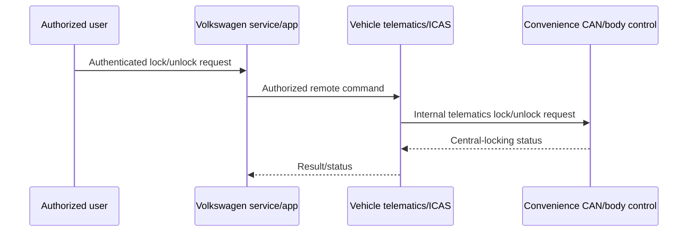

# CAN Lock/Unlock Research

Last reviewed: 2026-08-19

## Scope and Status

This document records research into controlling central locking on Volkswagen
Group MEB vehicles, with the Volkswagen ID.4 as the primary reference. It is
intended for development on a vehicle the operator owns or is authorized to
work on.

**Conclusion:** lock and unlock are technically represented on the MEB vehicle
network, but they are not a simple extension of the current EV-CAN preheating
implementation. The supported remote path includes authorization state, and no
public source found during this research provides a complete, verified, safe
static CAN command suitable for production use.

Door lock/unlock is not implemented in MEB Commander.

## What the Evidence Shows

### Separate vehicle network

Volkswagen's ID.4 architecture uses several distinct networks. The official
ID.4 training material identifies Convenience CAN as a separate 500 kbit/s bus
and places J533/ICAS1, J519, the J965 access/start interface, and burglary
protection modules in the relevant body-control architecture.

Source: [Volkswagen ID.4 Self Study Program 891213](https://vw-us.erwin-store.com/erwin/download.sealed?articleId=185906)

The current MEB Commander hardware connects to EV-CAN after the gateway. That
bus is used for battery-management, charging, and thermal functions. It is not
the Convenience CAN on which central-locking traffic is present.

See [MEB_NETWORKS_AND_MODULES.md](MEB_NETWORKS_AND_MODULES.md) for a wider
overview of the CAN domains, ICAS1/ICAS3 module roles, and automotive-Ethernet
fabric.

### Lock status and telematics command signals

The community MEB DBC in comma.ai's opendbc repository identifies:

- `0x583` / `ZV_02` as the central-locking status message. Its fields describe
  internal and external lock state, door-open state, SAFELOCK-related state,
  and whether complete lock status is available.
- `0x5A7` / `TM_01` as a telematics message with door-lock and door-unlock
  request fields and an 11-bit `TM_ZV_Signatur` field.

Sources:

- [opendbc `ZV_02` definition](https://github.com/commaai/opendbc/blob/b4ef5e1cf406ff143fa67bdbfb154739d43279c9/opendbc/dbc/generator/volkswagen/_vw_meb_common.dbc#L1438-L1480)
- [opendbc `TM_01` definition](https://github.com/commaai/opendbc/blob/b4ef5e1cf406ff143fa67bdbfb154739d43279c9/opendbc/dbc/generator/volkswagen/_vw_meb_common.dbc#L1548-L1555)

The DBC is strong evidence that both state reporting and a remote command path
exist. It is community-maintained evidence, not an official command protocol,
and signal names alone do not prove that an arbitrary node can issue a valid
request.

An independent ID.4 ICAS1 bench analysis also places central-locking and
telematics traffic on Convenience CAN. The researcher reports that J533 filters
traffic according to its source bus and that connecting at J533 permits
observation and research into body functions.

Source: [VW ID.4 ICAS1 Vehicle Control Analysis](https://gorgias.me/posts/vw-id4-vehicle-control-analysis/)

### Authorization is part of the supported remote path

The `TM_ZV_Signatur` field suggests that the telematics request carries
authorization or request-validation data. Its exact semantics, freshness rules,
and verification algorithm have not been established. This is consistent with
the official remote workflow requiring identity verification rather than
accepting a naked lock/unlock bit.

Volkswagen Finland's November 2025 service description lists remote locking
and unlocking for ID software 5.0, 5.2, and 5.4. It requires Volkswagen Ident
and confirmation with an S-PIN or biometric activation. The same availability
table does not list the service for ID software 3.x or 4.x. Availability can
still vary by vehicle, equipment, contract, software, and market.

Source: [Volkswagen Finland ID mobile-service description, edition 11/2025](https://www.volkswagen.fi/idhub/content/dam/onehub_master/pc/connectivity-and-mobility-services/we-connect-id/all-services/service-descriptions/Service-description_for-your-ID-vehicle_from-Software-3-0_11-2025_fi_FI.pdf)

The likely architecture is therefore:

This diagram is an inference from the official remote workflow and the CAN
signals. It is not a recovered Volkswagen protocol specification.

## Implications for MEB Commander

### The current bus cannot be reused

The existing controller is attached to EV-CAN and configured for CAN FD with a
500 kbit/s arbitration phase, 2 Mbit/s data phase, extended IDs, and filters for
battery-related traffic. Central locking is on the separate classical
500 kbit/s Convenience CAN and primarily uses standard 11-bit IDs.

J533 gateway isolation means an EV-CAN node should not be expected to control
a Convenience CAN function by transmitting the same body message on the wrong
bus.

### A second physical CAN interface is required

The ESP32-C5 contains two on-chip TWAI controllers and can, in principle, run
the existing EV-CAN node and a second classical CAN node simultaneously.

Source: [Espressif ESP32-C5 TWAI documentation](https://docs.espressif.com/projects/esp-idf/en/latest/esp32c5/api-reference/peripherals/twai.html)

The planned Convenience CAN interface needs:

- The second TWAI controller and a separate TX/RX GPIO pair.
- A second 3.3 V-compatible ISO 11898-2 transceiver.
- Classical CAN at 500 kbit/s with standard-ID filters.
- Hardware silent/standby control and low-current bus-wake support.
- No additional 120 ohm termination when attached as a stub to the existing
  vehicle network.
- Explicit software separation from EV-CAN; no transparent bridge.

The independent ICAS1 connector diagram labels J533 T40a pins 17 and 18 as
Convenience CAN-L and CAN-H. This has not been validated by this project and
must be checked against official wiring information for the exact vehicle.

### A static replay is not a production design

`ZV_02` is a state/status message, not evidence of a command that can be
toggled. `TM_01` includes explicit lock/unlock request fields, but it also
contains the unidentified signature field. A captured request may depend on
freshness, vehicle state, a synchronized counter, backend authorization, or
other state not represented in the public DBC.

Do not implement lock/unlock by hard-coding or repeatedly replaying a captured
frame until all changing fields, acceptance conditions, timeout behavior, and
replay resistance are understood.

### Diagnostic output tests are not the product path

Some body controllers may expose diagnostic output tests or protected
adaptations, but no public, verified MEB diagnostic routine for normal remote
locking was found. Volkswagen's SFD system protects software-controlled
vehicle functions and issues signed, logged tokens to authorized diagnostic
users. A temporary workshop output test is not a suitable persistent remote
control architecture.

Source: [Volkswagen Vehicle Diagnostics Protection (SFD)](https://privacy.volkswagen.com/download/get-document-content/en-GB/terms-of-use-SFD)

## Official Option First

Before developing a replacement, check the vehicle's ID software version,
equipment, market, Volkswagen account role, connectivity contract, and app.
For a compatible ID 5.x vehicle in Finland, the official Volkswagen app may
already provide remote lock/unlock with Volkswagen Ident and S-PIN/biometric
confirmation. That path preserves the manufacturer's authorization and vehicle
wake mechanisms.

For ID 3.x and 4.x vehicles, the November 2025 Finnish availability table does
not list remote lock/unlock. That absence does not prove the underlying control
units can safely accept a retrofitted or replayed 5.x command.

## Proposed Research Process

### 1. Establish exact vehicle scope

Record the model, model year, market, ID software version, gateway and J519
part/software versions, keyless-access equipment, SAFELOCK equipment, and
whether official app lock/unlock is available.

Obtain official wiring diagrams for that VIN before connecting to Convenience
CAN.

### 2. Build a listen-only interface

Add the second transceiver and initially configure its TWAI node as
listen-only. Validate:

- Correct 500 kbit/s classical CAN timing.
- Expected standard identifiers such as `ZV_02`.
- No error frames, unexpected acknowledgements, or additional termination.
- Vehicle networks still enter sleep normally after the logger stops.

### 3. Capture controlled actions

With the vehicle stationary and a physical recovery method available, record
separate traces for:

- Key-fob lock and unlock.
- Exterior handle/KESSY lock and unlock.
- Interior central-locking button operation.
- Official Volkswagen-app lock and unlock, if supported.
- Lock attempts with a door open, ignition/drive-ready active, or a key inside.

Compare pre-action, action, acknowledgement, status, and timeout traffic.
Separate command-origin messages from gateway-mirrored status messages.

### 4. Characterize authorization and freshness

For official remote commands, determine whether `TM_ZV_Signatur` or another
field changes between requests. Check whether an old request is rejected after
the first use, after a sleep cycle, or after a vehicle restart. Do not attempt
to bypass manufacturer security; the goal is to establish whether a supported,
owner-authorized integration path exists.

### 5. Transmit only after review

Any active test should first be reproduced on a bench or isolated test setup.
In-vehicle tests require:

- Vehicle stationary and unable to move.
- No people, children, or animals inside.
- A window open and a mechanical key/recovery path available.
- The normal key kept under the operator's control.
- Immediate hardware power removal.
- Strict frame allowlisting, bounded retries, and a short timeout.
- Confirmation from actual lock-state feedback rather than transmit success.

## Security Requirements

The current firmware must not expose door unlock. Its BLE GATT RX
characteristic permits writes without requiring encrypted/authenticated access,
and its OTA SHA-256 check provides integrity but not publisher authenticity.
Signed firmware and secure boot are not enabled.

Repository references: [BLE GATT definition](main/ble_console.c) and
[firmware update protocol](README.md#firmware-update-protocol).

Before an access-control feature can be considered deployable, implement and
verify:

- Authenticated, encrypted, and bonded local control or mutually authenticated
  end-to-end remote control.
- Per-command authorization with anti-replay nonces/counters and expiration.
- Secure storage and rotation of device credentials.
- Rate limiting, lockouts, and audit records for access-control attempts.
- Vehicle-state interlocks and explicit confirmation of lock-state changes.
- Signed firmware, secure boot, and a protected update/recovery path.
- A fail-closed design after resets, network loss, partial updates, or corrupt
  persistent state.
- No generic raw-CAN transmit method reachable through a remote interface.

BLE is short-range only. Internet-range operation additionally needs a
deliberate Wi-Fi or cellular architecture; simply placing an unauthenticated
bridge in front of the existing JSON-RPC service would be unsafe.

## Power and Wake Constraints

A remote controller must remain reachable without preventing the vehicle from
sleeping or discharging the 12 V battery. The final hardware needs an
automotive-rated low-quiescent-current supply, CAN transceivers with appropriate
standby/wake behavior, and firmware that stops all periodic traffic before the
vehicle sleeps.

Waking the ESP32 from a remote radio and waking the correct vehicle network are
separate operations. It is not yet known which Convenience CAN wake sequence or
selective-wake condition is accepted on each target MEB software version. This
must be measured rather than assumed.

## Open Questions

- Which model years and ID software versions accept the telematics locking
  request on Convenience CAN?
- What does `TM_ZV_Signatur` represent, and which module validates it?
- Are freshness or backend-derived values required for every request?
- What are the exact wake and sleep conditions on the target vehicle?
- How do SAFELOCK, keys detected inside, open doors, drive-ready state, and
  crash-unlock state affect acceptance?
- Which second-controller GPIOs and transceiver best fit the final board?
- Can a supported Volkswagen or approved third-party integration provide the
  required authorization without reproducing a security-critical protocol?

Until these questions are resolved, MEB Commander should limit Convenience CAN
work to physically controlled development setups and listen-only observation.
