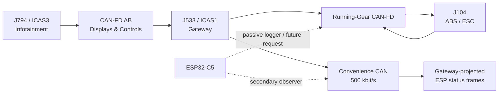
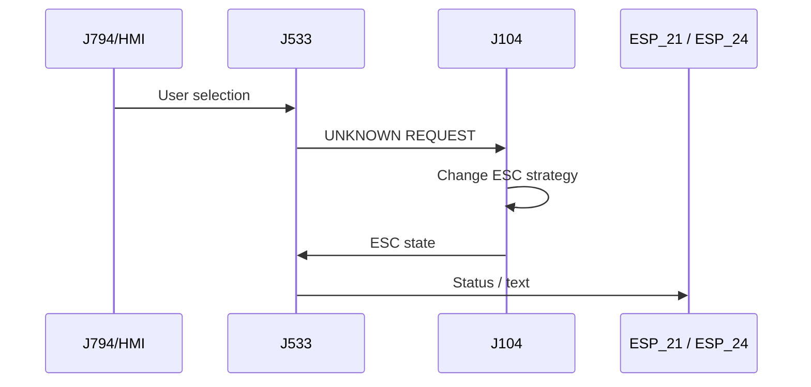

# Volkswagen MEB CAN Reverse Engineering: ASR Off / ESC Sport / ESC Off Selection

**Target vehicle:** Volkswagen ID.4 E21 / MEB  
**Primary vehicle context:** MY2021 rear-wheel-drive ID.4 Pro Performance  
**Goal:** Select **Normal / ASR Off / ESC Sport / ESC Off** through an external CAN-connected controller, even if the factory infotainment coding cannot expose all choices simultaneously.  
**Last updated:** 2026-08-23

> [!WARNING]
> J104/ESC is a safety-critical brake controller.
>
> Start with passive capture only. Do not fuzz the Running-Gear CAN. Any eventual
> transmit tests should be done with the vehicle stationary first, then only on a
> closed/private test area after the request semantics are understood.
>
> The goal is to reproduce a valid OEM **mode-selection request**, not to spoof wheel
> speeds, yaw rate, brake pressure, steering data or actuator commands.

---

# 1. Executive summary

The public MEB CAN information is already good enough to **observe** ESC/ASR state.

The most useful known frames are:

```text
0x31B ESP_24
0x0FD ESP_21
0x65D ESP_20
```

Important status fields include:

```text
ESP_24.ESP_Textanzeigen_03

6  = ESP switched off
7  = ASR off
8  = ESP/ASR on
17 = ESP sport
24 = ESP SuperSport
```

and:

```text
ESP_21.ASR_Tastung_passiv
ESP_21.ESP_Tastung_passiv
```

which indicate that ASR/ESP has been switched to a passive/reduced-threshold state.

However, the public DBC does **not** currently identify the user-selection request
sent when the infotainment menu changes from:

```text
Normal
ASR Off
ESC Sport
ESC Off
```

The best reverse-engineering strategy is therefore:

1. code the ABS unit so known selectable modes are exposed,
2. capture the user selecting each mode,
3. watch the **Running-Gear CAN-FD** where J104 physically resides,
4. simultaneously watch Convenience CAN for the already-decoded status responses,
5. identify the first request that precedes the J104 state change,
6. replay only that high-level OEM request.

---

# 2. Relevant MEB bus architecture



The exact transport path for the **mode-selection request** is still unknown.

Possible architectures:

### Architecture A — HMI/BAP request translated by J533

```text
J794
  |
  | BAP / HMI property
  v
J533
  |
  | translated ESC mode request
  v
J104
```

### Architecture B — directly routed cyclic CAN signal

```text
J794/J533
   |
   | normal cyclic CAN signal
   v
J104
```

### Architecture C — J533 owns the selection

```text
J794 tells J533 user choice
            |
            v
      J533 internal state
            |
            v
          J104
```

The capture experiment must distinguish these.

---

# 3. Relevant buses

## 3.1 Running-Gear CAN-FD

Volkswagen network documentation and independent ID.4 topology analysis place:

```text
J104 ABS / ESC
J500 EPS
NX6 brake booster
```

on the **Running-Gear CAN**.

| Property | Value |
|---|---|
| Protocol | CAN-FD |
| Arbitration bitrate | 500 kbit/s |
| Data bitrate | 2 Mbit/s |
| Primary relevance | Native J104 traffic and likely ESC mode command |
| Priority for reverse engineering | **Highest** |

For the actual mode request, this is the bus to capture first.

The ID.4 current-flow diagram contains a dedicated section:

```text
078 - Data bus network for running gear CAN bus
  1. Data bus network
  2. Electronically controlled damping control unit, J533
  3. J104 ABS control unit, brake servo
  4. J104 ABS control unit, power steering, brake servo
```

Verify the exact J533/T40a pin pair from the correct vehicle/current-flow revision
before connecting a second transceiver. Do not guess the pins from another MEB model.

---

## 3.2 Convenience CAN

| Property | Value |
|---|---|
| Protocol | Classic CAN |
| Bitrate | 500 kbit/s |
| Relevance | Gateway-projected ESC status, infotainment/body-visible state |

Independent ID.4 analysis explicitly lists:

```text
0x31B ESP_24
0x65D ESP_20
```

on Convenience CAN.

These are excellent **observer** messages even if the actual command originates
elsewhere.

---

## 3.3 CAN-FD AB / Displays & Controls

The infotainment J794 communicates through the MEB displays-and-controls network.

This bus may carry the HMI/BAP property change before J533 translates it into a J104
request.

If Running-Gear CAN shows only the final translated command, AB-CAN can still reveal
the higher-level user selection.

---

# 4. `0x31B` — `ESP_24`

**Confidence: High**

| Property | Value |
|---|---|
| CAN ID | `0x31B` |
| Decimal | 795 |
| Format | 11-bit, 8-byte |
| Known on | **Convenience CAN** |
| Function | ESC warning lamps, status text and related display state |

Public MEB DBC:

```text
BO_ 795 ESP_24: 8
```

Relevant fields:

| Signal | Start bit | Length | Physical location |
|---|---:|---:|---|
| `ESP_Lampe` | 12 | 1 | byte 1 bit 4 |
| `ABS_Lampe` | 13 | 1 | byte 1 bit 5 |
| `BK_Lampe_02` | 14 | 2 | byte 1 bits 6–7 |
| `TC_Lampe` | 16 | 1 | byte 2 bit 0 |
| `ESP_m_Raddrehz` | 17 | 15 | bytes 2–3 |
| **`ESP_Textanzeigen_03`** | **32** | **5** | **byte 4 bits 0–4** |
| `ESP_Meldungen` | 37 | 3 | byte 4 bits 5–7 |
| `ESP_Wegimp_VA` | 40 | 11 | bytes 5–6 |
| `ESP_Fehlerstatus_Wegimp` | 51 | 1 | byte 6 bit 3 |
| `ESP_Wegimp_Ueberlauf` | 52 | 1 | byte 6 bit 4 |
| `ESP_QBit_Wegimp_VA` | 53 | 1 | byte 6 bit 5 |
| `ESP_HDC_Geschw_Farbe` | 54 | 1 | byte 6 bit 6 |
| `ESP_Off_Lampe` | 55 | 1 | byte 6 bit 7 |
| `ESP_HDC_Regelgeschw` | 56 | 7 | byte 7 bits 0–6 |
| `ESP_BKV_Warnung` | 63 | 1 | byte 7 bit 7 |

### Mode/status text values

`ESP_Textanzeigen_03`:

| Value | Meaning |
|---:|---|
| 0 | no text |
| 1 | ESP fault |
| 2 | ABS fault |
| 3 | ESP/ABS fault |
| 4 | brake workshop/service |
| 5 | ASR fault |
| **6** | **ESP switched off** |
| **7** | **ASR off** |
| **8** | **ESP/ASR on** |
| 10 | no brake booster |
| 11 | ASR activated |
| 12 | ABS/ASR fault |
| 15 | ESP offroad |
| **17** | **ESP sport** |
| 18 | forced ESP activation |
| 19 | ESP button/info |
| 20 | TC active |
| 22 | TC switched off |
| **24** | **ESP SuperSport** |
| 25 | ESP Offroad unavailable |

### Decoder

```c
uint8_t esp_text =
    data[4] & 0x1FU;

bool esp_off_lamp =
    (data[6] & 0x80U) != 0;

bool esp_lamp =
    (data[1] & 0x10U) != 0;

bool tc_lamp =
    (data[2] & 0x01U) != 0;
```

This frame gives an immediate way to classify the mode selected by the OEM system.

---

# 5. `0x0FD` — `ESP_21`

**Confidence: High for fields; exact bus routing must be captured**

| Property | Value |
|---|---|
| CAN ID | `0x0FD` |
| Decimal | 253 |
| Format | 11-bit, 8-byte |
| Protection | CRC + rolling counter |
| Function | Dynamic ESC/ASR state and brake intervention |

Public MEB DBC:

```text
BO_ 253 ESP_21: 8
```

Relevant fields:

| Signal | Start bit | Length | Byte/bit |
|---|---:|---:|---|
| `CHECKSUM` | 0 | 8 | byte 0 |
| `COUNTER` | 8 | 4 | byte 1 low nibble |
| `BR_Eingriffsmoment` | 12 | 10 | intervention torque |
| `ESP_Diagnose` | 23 | 1 | |
| `ESC_v_Signal_Qualifier_High_Low` | 24 | 3 | |
| `ESP_Vorsteuerung` | 28 | 1 | |
| `ESP_v_Signal` | 32 | 16 | vehicle speed |
| **`ASR_Tastung_passiv`** | **48** | **1** | **byte 6 bit 0** |
| **`ESP_Tastung_passiv`** | **49** | **1** | **byte 6 bit 1** |
| `ESP_Systemstatus` | 50 | 1 | byte 6 bit 2 |
| `ASR_Schalteingriff` | 51 | 2 | byte 6 bits 3–4 |
| `ESP_QBit_v_Signal` | 55 | 1 | byte 6 bit 7 |
| `ABS_Bremsung` | 56 | 1 | byte 7 bit 0 |
| `ASR_Anf` | 57 | 1 | byte 7 bit 1 |
| `MSR_Anf` | 58 | 1 | byte 7 bit 2 |
| `EBV_Eingriff` | 59 | 1 | byte 7 bit 3 |
| `EDS_Eingriff` | 60 | 1 | byte 7 bit 4 |
| `ESP_Eingriff` | 61 | 1 | byte 7 bit 5 |
| `ESP_ASP` | 62 | 1 | byte 7 bit 6 |

### Important values

```text
ASR_Tastung_passiv:
0 = ASR active
1 = ASR switched passive / thresholds changed

ESP_Tastung_passiv:
0 = ESP active
1 = ESP switched passive / thresholds changed

ESP_Systemstatus:
0 = OK
1 = fault
```

These two passive-mode bits are especially useful when comparing:

```text
Normal
ASR Off
ESC Sport
ESC Off
```

### Decoder

```c
bool asr_passive =
    (data[6] & 0x01U) != 0;

bool esp_passive =
    (data[6] & 0x02U) != 0;

bool esp_fault =
    (data[6] & 0x04U) != 0;

bool abs_regulating =
    (data[7] & 0x01U) != 0;

bool esp_intervening =
    (data[7] & 0x20U) != 0;
```

---

# 6. `ESP_21` CRC / rolling counter

`ESP_21` is protected by Volkswagen's common CRC8 mechanism.

Observed MEB seed sequence for `0x0FD`:

```text
counter  0: B4
counter  1: EF
counter  2: F8
counter  3: 49
counter  4: 1E
counter  5: E5
counter  6: C2
counter  7: C0
counter  8: 97
counter  9: 19
counter 10: 3C
counter 11: C9
counter 12: F1
counter 13: 98
counter 14: D6
counter 15: 61
```

Algorithm family:

```text
CRC-8 polynomial: 0x2F
initial value:    0xFF
final XOR:        0xFF
counter-dependent data-ID / PDU seed
```

The rolling counter is:

```c
uint8_t counter =
    data[1] & 0x0F;
```

This is useful if any eventual request frame uses the same Volkswagen E2E pattern.

Do **not** try to control ESC by spoofing `ESP_21`. It appears to be a status/output
message from the brake/ESC domain, not the user-selection request.

---

# 7. `0x65D` — `ESP_20`

**Confidence: High**

| Property | Value |
|---|---|
| CAN ID | `0x65D` |
| Decimal | 1629 |
| Format | 11-bit, 8-byte |
| Known on | Convenience CAN |
| Protection | CRC + rolling counter |
| Interesting role | ESC configuration / driving-profile state |

Relevant fields:

| Signal | Start bit | Length |
|---|---:|---:|
| `ESP_20_CRC` | 0 | 8 |
| `ESP_20_BZ` | 8 | 4 |
| `BR_Systemart` | 12 | 2 |
| `ESP_SpannungsAnf_02` | 14 | 2 |
| `ESP_Zaehnezahl` | 16 | 8 |
| **`ESP_Charisma_FahrPr`** | **24** | **4** |
| **`ESP_Charisma_Status`** | **28** | **2** |
| `ESP_Wiederstart_Anz_01` | 30 | 1 |
| `ESP_Wiederstart_Anz_02` | 31 | 1 |
| `ESP_Wiederstart_Anz_03` | 32 | 1 |
| `ESP_Wiederstart_Anz_04` | 33 | 1 |

### `BR_Systemart`

```text
0 = ABS
1 = ABS + ASR
2 = ESP
3 = ESP with integrated EPB
```

### `ESP_Charisma_FahrPr`

```text
0  = no function
1  = program 1
...
15 = program 15
```

### `ESP_Charisma_Status`

```text
0 = init
1 = available
2 = unavailable
3 = asynchronous due to driver request
```

The `Charisma` fields normally relate to driving-profile behavior, so they may not
directly represent ASR/ESC mode. They are still worth logging because ESC mode
selection could alter or asynchronously override a profile-controlled ESC
characteristic.

The public value table also identifies:

```text
ESP_Wiederstart_Anz_04 = 1 -> ESC_Off indication
```

which is useful as an additional state confirmation.

---

# 8. `ESP_20` CRC seed

Known MEB seed sequence for `0x65D`:

```text
AC B3 AB EB 7A E1 3B F7
73 BA 7C 9E 06 5F 02 D9
```

Mapped to rolling counter 0..15.

Again, this is primarily useful for understanding Volkswagen frame protection.

---

# 9. Other relevant ESC/ABS IDs

Independent ID.4 analysis identified the following MEB safety-domain frames:

| ID | Name | Notes |
|---|---|---|
| `0x0FC` | `ESC_51` | safety-domain frame; public field map not currently available here |
| `0x102` | `ESC_50` | safety-domain frame |
| `0x116` | `ESP_10` | wheel pulse / wheel-speed related status |
| `0x0FD` | `ESP_21` | ASR/ESP passive state and intervention |
| `0x31B` | `ESP_24` | display/status text |
| `0x65D` | `ESP_20` | configuration/profile-related state |

Known MEB CRC seed families:

```text
ESC_50 0x102:
D7 12 85 7E 0B 34 FA 16
7A 25 2D 8F 04 8E 5D 35

ESC_51 0x0FC:
77 5C A0 89 4B 7C BB D6
1F 6C 4F F6 20 2B 43 DD

ESP_10 0x116:
AC AC AC AC AC AC AC AC
AC AC AC AC AC AC AC AC

ESP_20 0x65D:
AC B3 AB EB 7A E1 3B F7
73 BA 7C 9E 06 5F 02 D9

ESP_21 0x0FD:
B4 EF F8 49 1E E5 C2 C0
97 19 3C C9 F1 98 D6 61

ESP_24 0x31B:
67 8A AE 22 4D D0 51 80
5C B9 CE 1E DF 02 2D D4
```

Note that OpenDBC's current `ESP_24` definition does not expose CRC/counter fields,
so treat the listed seed as reverse-engineering evidence rather than proof that the
specific routed Convenience-CAN copy needs a checksum generated by the receiver.

---

# 10. Factory mode-selection behavior

Volkswagen ID.4 documentation describes the infotainment path approximately as:

```text
Vehicle
  -> Exterior
  -> Brakes
  -> ESC system
```

Depending on drivetrain/software/coding, the vehicle may expose:

```text
Normal
ASR Off / ASR Sport
ESC Sport
ESC Off
```

Factory coding determines which alternatives appear.

The selection normally returns toward the default safety mode after a vehicle cycle.

This is helpful for reverse engineering because the infotainment provides a clean,
repeatable stimulus.

---

# 11. Known MEB long-coding combinations as capture tools

These are useful **not because the final project should rely on coding**, but because
they let us make the car produce known ASR/ESC states for CAN capture.

Reported early-MEB ABS coding examples include:

| Mode exposed | Byte 22 | Byte 34 |
|---|---:|---:|
| Factory example | `11` | `88` |
| ASR Off | `21` | `84` |
| ESC Sport | `61` | `86` |
| ESC Sport + ESC Off | `68` | `16` |

These were reported on early MEB software including a MY2021 ID.3 / related ID.4
community discussion.

Exact ABS software/coding version matters. Always preserve the original coding.

The key use for this project is:

```text
coding A -> generate ASR Off captures
coding B -> generate ESC Sport captures
coding C -> generate ESC Off captures
```

Then restore whichever coding is desired.

---

# 12. What the known status frames should look like

## Normal

Expected:

```text
ESP_24.ESP_Textanzeigen_03:
0 or transient 8 depending on implementation

ESP_21.ASR_Tastung_passiv:
0

ESP_21.ESP_Tastung_passiv:
0
```

## ASR Off

Expected:

```text
ESP_24.ESP_Textanzeigen_03 = 7

ESP_21.ASR_Tastung_passiv = 1
```

`ESP_Tastung_passiv` needs empirical confirmation.

## ESC Sport

Expected:

```text
ESP_24.ESP_Textanzeigen_03 = 17

ESP_21.ESP_Tastung_passiv = 1
```

ASR status may also change depending on exact MEB calibration.

## ESC Off

Expected:

```text
ESP_24.ESP_Textanzeigen_03 = 6

ESP_24.ESP_Off_Lampe likely = 1
ESP_21.ESP_Tastung_passiv likely = 1
```

These expected combinations must be verified on the target vehicle.

---

# 13. Why `ESP_24` is probably not the control frame

`ESP_24` contains:

```text
warning lamp state
status text
wheel-frequency data
display requests
```

This strongly looks like **J104/gateway -> displays** status.

Changing its text field would at best fake the UI.

It would not be expected to change J104's actual intervention strategy.

Therefore:

```text
DO NOT:
inject ESP_24 "ESP switched off" text
and assume ESC is actually off
```

The real control request must cause **J104 itself** to change behavior, after which
`ESP_24` becomes confirmation.

---

# 14. Why `ESP_21` is probably not the control frame

`ESP_21` exposes:

```text
ASR passive
ESP passive
ABS regulation
ESP intervention
vehicle speed
braking intervention state
```

This is also strongly shaped like an output/status message.

The important model is:

```text
request -> J104 state change -> ESP_21 / ESP_24 status changes
```

We need the request on the left side of that chain.

---

# 15. Primary reverse-engineering experiment

## Required capture points

Best:

```text
CAN #1 -> Running-Gear CAN-FD
CAN #2 -> Convenience CAN
```

Optional third capture:

```text
CAN-FD AB / Displays & Controls
```

If only one extra CAN controller is available, **Running-Gear CAN-FD has priority**.

---

# 16. Capture procedure

Start with the car stationary.

For each mode, capture:

```text
10 s baseline
select mode in infotainment
20 s after selection
```

Repeat at least three times:

```text
Normal -> ASR Off
ASR Off -> Normal

Normal -> ESC Sport
ESC Sport -> Normal

Normal -> ESC Off
ESC Off -> Normal
```

If the menu allows direct transitions:

```text
ASR Off -> ESC Sport
ESC Sport -> ESC Off
ESC Off -> ASR Off
```

These differential transitions are especially valuable.

---

# 17. Timestamp all buses against one clock

If using two CAN controllers on one ESP32:

```text
timestamp from same monotonic microsecond timer
```

Example log:

```text
timestamp_us,bus,id,ext,fd,brs,dlc,data

32500123,RG,0x123,0,1,1,8,AABBCCDDEEFF0011
32500311,CONV,0x31B,0,0,0,8,...
```

This lets us establish causal order:

```text
unknown request on Running-Gear CAN
          ↓ 4 ms
J104 changes state
          ↓ 2 ms
ESP_21 changes
          ↓ 5 ms
gateway publishes ESP_24 text
```

---

# 18. First-pass filtering

Known observer IDs:

```text
0x0FD ESP_21
0x31B ESP_24
0x65D ESP_20
0x0FC ESC_51
0x102 ESC_50
0x116 ESP_10
```

Do **not** filter the capture to only these.

The request ID is unknown.

Log all frames, then rank IDs by:

```text
new frames around selection
bytes that change only during selection
one-shot command-like frames
cyclic frames that change mode field
frames whose transition precedes ESP_24
```

---

# 19. Differential-analysis strategy

For every ID:

```text
baseline = frames_before_event
event = frames_after_click

compare:
    frequency
    payload values
    changed bits
    first-change timestamp
    duration
```

Ignore:

- wheel speed changes,
- steering-angle noise,
- counters,
- CRC bytes,
- periodic timing jitter.

Promote:

- a stable enum changing exactly with selected mode,
- a short request burst at click time,
- a frame whose value persists until Normal is selected,
- a frame that changes before `ESP_21` / `ESP_24`.

---

# 20. Use known status as labels

Automatically label each capture from `ESP_24`:

```c
switch (data[4] & 0x1F) {
case 6:
    mode = ESC_OFF;
    break;

case 7:
    mode = ASR_OFF;
    break;

case 17:
    mode = ESC_SPORT;
    break;

case 24:
    mode = ESC_SUPERSPORT;
    break;

default:
    break;
}
```

Then search other IDs for payload fields statistically correlated with that label.

---

# 21. Bit-correlation technique

Suppose candidate ID `X` has byte 5:

```text
Normal     00
ASR Off    01
ESC Sport  02
ESC Off    03
```

That is ideal.

But the field could instead be one-hot:

```text
Normal     00
ASR Off    04
ESC Sport  10
ESC Off    20
```

For each bit, calculate:

```text
P(bit=1 | Normal)
P(bit=1 | ASR Off)
P(bit=1 | ESC Sport)
P(bit=1 | ESC Off)
```

Bits with near-perfect mode correlation become candidates.

---

# 22. Request vs status direction

A difficult part of CAN reverse engineering is distinguishing command from feedback.

Use temporal ordering:



The request must occur before the status confirmation.

---

# 23. Gateway-routing issue

The J533 gateway isolates MEB buses.

A message visible on Convenience CAN may be a **gateway-generated copy**, while a
frame injected there may not be routed back toward J104.

Therefore:

```text
Seeing a useful frame on Convenience CAN
does NOT prove
transmitting it on Convenience CAN will control J104.
```

This has already been observed for other MEB control domains.

For ESC mode control, eventually transmit on the bus on which **J104 actually consumes
the request**.

Most likely:

```text
Running-Gear CAN-FD
```

---

# 24. Possibility of BAP control

Volkswagen uses BAP (Bedien- und Anzeigeprotokoll) extensively for infotainment
properties.

ESC mode is selected from the central infotainment UI, so one plausible architecture
is:

```text
HMI property -> BAP -> J533 -> J104
```

If no obvious Running-Gear frame changes at the instant of menu selection:

1. capture CAN-FD AB,
2. look for extended 29-bit request/response traffic,
3. identify the BAP function instance associated with brakes/ESC,
4. correlate property values with ASR/ESC selections.

Do not assume ordinary 11-bit broadcast control if the HMI path is BAP.

---

# 25. Potential J104-facing frame protection

If the command is safety-critical, expect one or more of:

```text
rolling counter
CRC-8 / AUTOSAR E2E
data-ID / PDU seed
alive counter
plausibility state
source bus validation
SecOC / authentication on newer implementations
```

The known ESC frames already show extensive CRC usage.

If a candidate request changes:

```text
byte 0 apparently random
byte 1 low nibble increments 0..15
```

it probably follows the common VW pattern.

---

# 26. Volkswagen CRC8 family

Common MEB pattern:

```text
byte 0: CRC
byte 1 low nibble: counter
```

Typical calculation family:

```text
poly   = 0x2F
init   = 0xFF
xorout = 0xFF
```

with an additional counter-indexed per-message seed.

Do not assume the seed from `ESP_21` applies to the unknown request ID.

Recover the seed using:

- known-good captures for every counter value,
- the standard CRC algorithm,
- brute-force per-counter seed byte if necessary.

---

# 27. Candidate implementation after request discovery

The ESP32 API could expose:

```c
typedef enum {
    ESC_MODE_NORMAL,
    ESC_MODE_ASR_OFF,
    ESC_MODE_SPORT,
    ESC_MODE_OFF
} meb_esc_mode_t;

bool meb_esc_set_mode(meb_esc_mode_t mode);
meb_esc_mode_t meb_esc_get_mode(void);
```

`get_mode()` should read **J104-derived status**, not trust the command last sent.

---

# 28. State verification

Example:

```c
bool request_esc_mode(meb_esc_mode_t requested)
{
    send_oem_esc_mode_request(requested);

    uint64_t deadline = now_ms() + 1000;

    while (now_ms() < deadline) {
        meb_esc_mode_t actual = decode_esp_24();

        if (actual == requested) {
            return true;
        }
    }

    return false;
}
```

If confirmation fails:

```text
do not continuously spam the safety-critical bus
```

Return to Normal / stop transmitting.

---

# 29. Vehicle-cycle behavior

Community reports say the MEB ESC mode returns to the normal/default state after the
vehicle is switched off.

The external controller should respect that OEM behavior.

Recommended:

```text
ESP32 boot / vehicle wake:
assume Normal until J104 status proves otherwise
```

Do not automatically reapply ESC Off on every startup.

A deliberate user action should be required.

---

# 30. Suggested UI

Because the original motivation is that long coding may not expose all options
simultaneously, the ESP32 can provide its own selector:

```text
ESC / Traction

[ Normal ]
[ ASR Off ]
[ ESC Sport ]
[ ESC Off ]
```

Display actual confirmed state separately:

```text
Requested: ESC Off
Actual:    ESC Off
```

If no J104 confirmation:

```text
Requested: ESC Off
Actual:    Normal
Result:    rejected
```

---

# 31. Recommended first captures

Priority order:

### Capture A

```text
Normal -> ASR Off
```

Why:

- easiest known alternate mode,
- `ESP_24 = 7` is a strong label.

### Capture B

```text
Normal -> ESC Sport
```

Expected:

```text
ESP_24 = 17
```

### Capture C

```text
Normal -> ESC Off
```

Expected:

```text
ESP_24 = 6
ESP_Off_Lampe likely 1
```

### Capture D

```text
ESC Sport -> ESC Off
```

This removes many generic "leaving Normal" changes and isolates the mode difference.

---

# 32. What not to reverse engineer first

Avoid starting with:

```text
wheel-speed spoofing
yaw-rate spoofing
steering-angle spoofing
brake-pressure spoofing
motor-torque manipulation
ESP actuator requests
```

None of those are necessary for selecting a factory-supported ESC mode.

The target is a **mode selection**, not a brake intervention.

---

# 33. Known-message summary

| ID | Name | Likely/native domain | Best use |
|---|---|---|---|
| `0x0FD` | `ESP_21` | ESC / Running-Gear | Verify passive ASR/ESP state and interventions |
| `0x31B` | `ESP_24` | gateway-projected to Convenience CAN | **Best human-readable mode confirmation** |
| `0x65D` | `ESP_20` | gateway-projected to Convenience CAN | Profile/ESC state correlation |
| `0x0FC` | `ESC_51` | Running-Gear / ESC | Candidate correlation frame |
| `0x102` | `ESC_50` | Running-Gear / ESC | Candidate correlation frame |
| `0x116` | `ESP_10` | Running-Gear / ESC | Wheel pulse/status; mostly observer/noise for this task |
| **unknown** | **ESC mode request** | probably Running-Gear CAN-FD | **Primary reverse-engineering target** |

---

# 34. Open questions

1. Which exact CAN ID requests ASR Off / ESC Sport / ESC Off?
2. Is the request cyclic or edge-triggered?
3. Is the request sent by J533 or another controller?
4. Does J794 use BAP and J533 translate the selection?
5. Does the request exist on AB-CAN, Running-Gear CAN, or both?
6. Does the gateway reject a request injected from the wrong bus?
7. Does the request require CRC/counter?
8. Does it require a valid ignition/drive-state condition?
9. Can all four states be requested even when long coding exposes only some of them?
10. Does ABS long coding merely configure **which requests are accepted**, meaning an
    unexposed mode may still be rejected?
11. Is "ESC Off" a distinct J104 mode or a variant of ESP passive state plus another
    parameter?
12. How does rear-wheel-drive behavior differ from GTX/4MOTION?
13. Does a speed threshold force ESC back on?
14. Does braking/ACC/Travel Assist force reactivation?
15. Can the mode be changed while stationary only, or also at low speed?
16. Does J104 publish a direct numeric mode field not yet named in the public DBC?

---

# 35. Important test: coding dependency

One key experiment:

1. Code vehicle for `ASR Off`.
2. Capture the ASR Off request.
3. Restore coding that exposes only ESC Sport.
4. Replay the previously captured ASR Off request while stationary.
5. Observe whether J104 accepts or rejects it.

This tells us whether long coding controls:

```text
HMI menu only
```

or:

```text
J104's allowed mode set
```

If it is HMI-only, the CAN controller may truly provide all modes.

If J104 validates the coding, an unsupported selection will be rejected.

---

# 36. Suggested hardware arrangement

If keeping the existing EV-CAN battery/climate project:

```text
ESP32-C5 CAN controller #1
    -> EV-CAN

ESP32-C5 CAN controller #2
    -> Running-Gear CAN-FD
```

That is sufficient for:

```text
battery preheat / camp mode
+
ESC mode RE
```

but it means Convenience CAN cannot be simultaneously attached using only the two
internal CAN controllers.

Options:

1. temporarily move one controller to Convenience during capture,
2. add an external CAN controller,
3. use a second ESP32-C5,
4. rely on Running-Gear status if the needed ESP frames are visible there.

For the ESC project, Running-Gear CAN is more valuable than Convenience CAN.

---

# 37. Sources

## OpenDBC MEB DBC

https://github.com/commaai/opendbc/blob/master/opendbc/dbc/generator/volkswagen/_vw_meb_common.dbc

Used for:

```text
ESP_21
ESP_24
ESP_20
field positions
enum values
```

## Gorgias — VW ID.4 ICAS1 Vehicle Control Analysis

https://gorgias.me/posts/vw-id4-vehicle-control-analysis/

Used for:

- ID.4 bus topology,
- J104 on Running-Gear CAN,
- Convenience-CAN message inventory,
- MEB CRC seed sequences,
- gateway-isolation observations.

## Volkswagen ID.4 owner/service information

ID.4 ASR/ESC operating description:

https://www.vw-id4.com/switching-asr-sport-and-esc-sport-on-and-off-167.html

## MEB coding discussion

VAGarena early-MEB example:

https://www.vagarena.fi/index.php?topic=46749.990

ID.4/ID.6 OBDeleven coding collection:

https://driver.top/communities/id540/537468

## ID.4 wiring diagrams

https://de.ifixit.com/Document/Xll2UsH2BgbxaJns/VW-ID4-Wiring-Diagrams-Eng.pdf

Relevant section:

```text
078 - Data bus network for running gear CAN bus
```

## Volkswagen SSP 718 — The ID.4

https://esperformance.net/ssp/vw/SSP_718_EN.pdf

## Volkswagen SSP 891213 — ID.4 New Model Overview

https://static.nhtsa.gov/odi/tsbs/2021/MC-10189712-0001.pdf

---

# 38. Immediate next step

The highest-value experiment is a **dual-bus capture**:

```text
Running-Gear CAN-FD
+
Convenience CAN
```

while performing:

```text
Normal -> ASR Off
Normal -> ESC Sport
Normal -> ESC Off
```

Use `0x31B.ESP_Textanzeigen_03` as the label for when J104 has actually accepted
each mode.

Then search backward in time on Running-Gear CAN for the first mode-specific change.

That unknown preceding frame is the primary candidate for the OEM ESC mode-selection
request.
