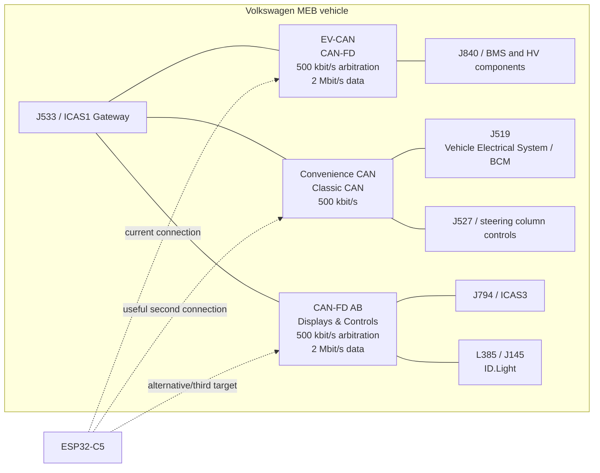
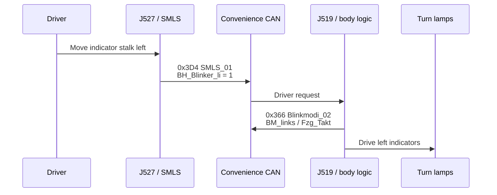
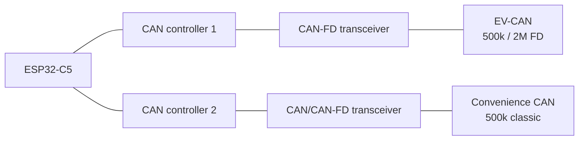
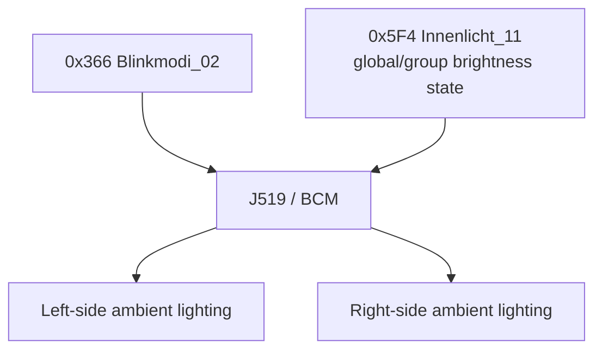
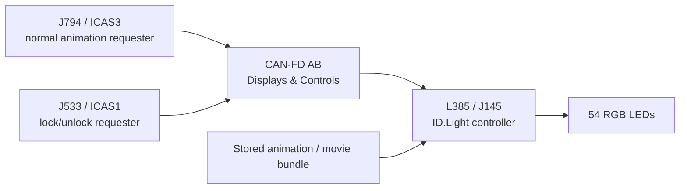
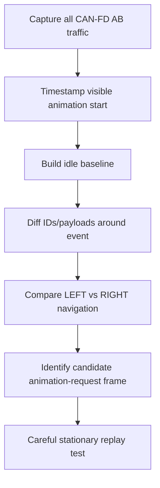
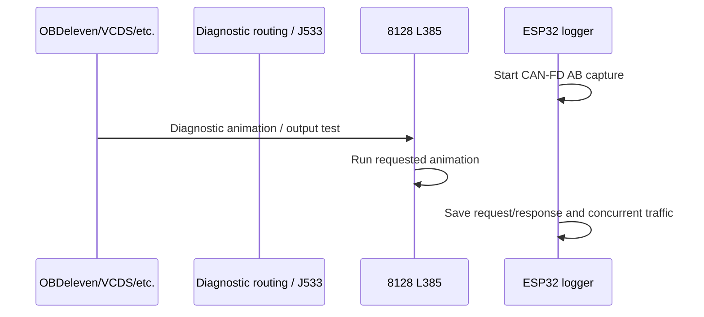
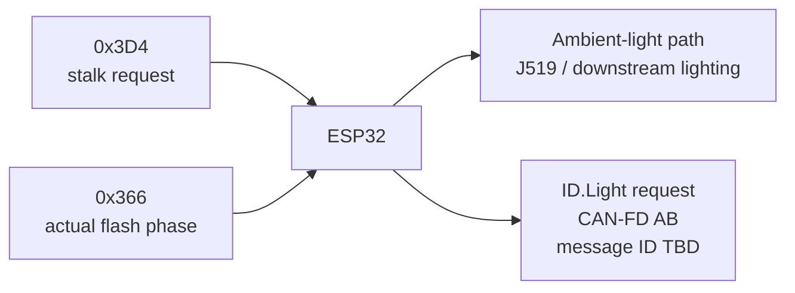

# Volkswagen MEB CAN Notes: Turn Signals, Stalk State, Ambient Lighting and ID.Light

**Target vehicle:** Volkswagen ID.4 (MEB, early/pre-2024 generation)  
**Primary test vehicle context:** 2021 ID.4 Pro Performance  
**Last updated:** 2026-08-22

> [!WARNING]
> This document is a reverse-engineering note, not Volkswagen service documentation.
> Start with passive listening only. CAN buses connect safety-critical control units.
> Do not inject guessed frames into a moving vehicle. Verify wiring against the exact
> vehicle's current-flow diagrams before connecting hardware.

## 1. Scope

This document summarizes currently known information relevant to:

1. Detecting the **actual turn-signal/blinker state** over CAN.
2. Detecting the **turn-signal stalk position/request** over CAN.
3. Determining which **MEB CAN network** carries each relevant message.
4. Investigating the interior ambient-light messages associated with the blinker feature.
5. Investigating and eventually controlling the **ID.Light** dashboard LED strip.
6. Integrating the above with an ESP32-C5 CAN/CAN-FD device such as `meb-preheat-esp32`.

The most important conclusion is that these functions are split across different MEB networks:

- **EV-CAN** — current battery/preheating project.
- **Convenience CAN** — turn signals, stalk state and body/lighting state.
- **CAN-FD AB (Displays & Controls)** — ID.Light / L385.

---

## 2. Confidence labels

| Label | Meaning |
|---|---|
| **Confirmed** | Supported by Volkswagen documentation and/or public MEB DBC data. |
| **Strong evidence** | Supported by multiple reverse-engineering/service sources, but not yet verified on the specific car. |
| **Candidate** | Worth testing, but routing/meaning still needs vehicle capture confirmation. |
| **Unknown** | No trustworthy public message definition has been found yet. |

---

## 3. Relevant MEB network topology



### Network summary

| Network | Physical protocol | Main relevance here | Example messages/devices |
|---|---|---|---|
| **EV-CAN** | CAN-FD, 500 kbit/s arbitration / 2 Mbit/s data | Existing preheater/BMS project | `0x12DD54D2`, `0x1A5555B2`, diagnostic traffic |
| **Convenience CAN** | Classic CAN, 500 kbit/s | **Best bus for blinkers and stalk position** | `0x366`, `0x3D4`, `0x5F4`, `0x12DD54C9` |
| **CAN-FD AB** | CAN-FD, 500 kbit/s arbitration / 2 Mbit/s data | **ID.Light** | L385/J145, J794/ICAS3 |
| Connectivity CAN | Classic CAN, 500 kbit/s | KESSY/remote connectivity related functions | Not the main target here |
| Running gear / Driver Assist / Powertrain CAN-FD | CAN-FD | Chassis/ADAS/drivetrain | Not required for this project |

Volkswagen calls AB CAN the **CAN data bus for displays and controls**. Volkswagen training material explicitly places L385 (ID.Light) on this network.

---

# Part I — Turn signal / blinker detection

## 4. Recommended message: `0x366 Blinkmodi_02`

**Confidence: Confirmed**

`Blinkmodi_02` is the most useful known message when the goal is to synchronize another light with the vehicle's actual blinker cadence.

| Property | Value |
|---|---|
| CAN ID | `0x366` |
| Decimal ID | `870` |
| Frame format | Standard 11-bit CAN |
| Payload | 8 bytes |
| Bus | **Convenience CAN** |
| Typical source/function | Blinking mode / body-light state |
| Best use | Actual blinker mode and actual flash phase |

Public MEB DBC data defines the following signals:

| Signal | DBC start bit | Length | Approx. byte/bit | Meaning |
|---|---:|---:|---|---|
| `BM_ZV_auf` | 12 | 1 | byte 1 bit 4 | Unlock-related flash mode |
| `BM_ZV_zu` | 13 | 1 | byte 1 bit 5 | Lock-related flash mode |
| `BM_DWA_ein` | 14 | 1 | byte 1 bit 6 | Alarm-related state |
| `BM_DWA_Alarm` | 15 | 1 | byte 1 bit 7 | Alarm flashing |
| `BM_Crash` | 16 | 1 | byte 2 bit 0 | Crash flashing |
| `BM_Panik` | 17 | 1 | byte 2 bit 1 | Panic flashing |
| `BM_Not_Bremsung` | 18 | 1 | byte 2 bit 2 | Emergency-braking-related mode |
| `BM_Warnblinken` | 20 | 1 | byte 2 bit 4 | Hazard warning active |
| `BM_links` | 23 | 1 | byte 2 bit 7 | Left blinker requested/active |
| `BM_rechts` | 24 | 1 | byte 3 bit 0 | Right blinker requested/active |
| **`Blinken_li_Fzg_Takt`** | **25** | **1** | **byte 3 bit 1** | **Actual left vehicle flash phase** |
| **`Blinken_re_Fzg_Takt`** | **26** | **1** | **byte 3 bit 2** | **Actual right vehicle flash phase** |
| `Blinken_li_Kombi_Takt` | 27 | 1 | byte 3 bit 3 | Left cluster indicator phase |
| `Blinken_re_Kombi_Takt` | 28 | 1 | byte 3 bit 4 | Right cluster indicator phase |

### Recommended decoder

For synchronizing an added interior light with the physical vehicle blink cycle:

```c
bool left_requested  = (data[2] & 0x80U) != 0;
bool right_requested = (data[3] & 0x01U) != 0;

bool left_flash_phase  = (data[3] & 0x02U) != 0;
bool right_flash_phase = (data[3] & 0x04U) != 0;

bool hazards = (data[2] & 0x10U) != 0;
```

The most interesting signals are:

```text
Blinken_li_Fzg_Takt
Blinken_re_Fzg_Takt
```

`Fzg_Takt` is the vehicle flash clock/phase. These should be preferred over simply checking the stalk because they can follow the vehicle's actual blinking state, including cases such as:

- normal latched left/right indicator,
- comfort/lane-change blinking,
- hazard lights,
- post-stalk automatic cancellation,
- potentially other BCM-generated blinking modes.

### Message frequency

Openpilot's Volkswagen MEB integration notes that `Blinkmodi_02` has a variable rate:

- approximately **1 Hz while no relevant light function is active**,
- approximately **50 Hz while active**.

This makes the frame suitable for following the flash phase with low latency.

---

## 5. Turn-signal stalk request: `0x3D4 SMLS_01`

**Confidence: Confirmed**

`SMLS_01` reports the driver's steering-column/stalk request. This is logically earlier in the signal chain than `Blinkmodi_02`.

| Property | Value |
|---|---|
| CAN ID | `0x3D4` |
| Decimal ID | `980` |
| Frame format | Standard 11-bit CAN |
| Payload | 8 bytes |
| Bus | **Convenience CAN** |
| Origin/function | Steering column / stalk controls |
| Best use | Detect exactly what the driver is requesting |

Relevant public MEB DBC fields:

| Signal | DBC start bit | Length | Approx. byte/bit | Meaning |
|---|---:|---:|---|---|
| `SMLS_01_CRC` | 0 | 8 | byte 0 | CRC |
| `SMLS_01_BZ` | 8 | 4 | byte 1 bits 0–3 | Rolling counter |
| **`BH_Blinker_li`** | **12** | **1** | **byte 1 bit 4** | **Left blinker stalk request** |
| **`BH_Blinker_re`** | **13** | **1** | **byte 1 bit 5** | **Right blinker stalk request** |
| `BH_Lichthupe` | 14 | 1 | byte 1 bit 6 | Headlight flash |
| `BH_Fernlicht` | 15 | 1 | byte 1 bit 7 | High beam |
| `WH_Tipwischen` | 16 | 1 | byte 2 bit 0 | Tip-wipe |
| `WH_Intervall` | 17 | 1 | byte 2 bit 1 | Intermittent wipe |
| `WH_WischerStufe1` | 18 | 1 | byte 2 bit 2 | Wiper stage 1 |
| `WH_WischerStufe2` | 19 | 1 | byte 2 bit 3 | Wiper stage 2 |
| `WH_Frontwaschen` | 20 | 1 | byte 2 bit 4 | Front wash |

### Simple decoder

```c
bool stalk_left  = (data[1] & 0x10U) != 0;
bool stalk_right = (data[1] & 0x20U) != 0;
```

### Stalk state vs actual blinking



Use `0x3D4` when the question is:

> "What is the driver doing with the stalk?"

Use `0x366` when the question is:

> "What is the car actually doing with the blinkers?"

For the ambient-light-following-blinker feature, `0x366` is normally the better input.

---

## 6. Additional candidate: `0x12DD54C9 SAL_01`

**Confidence: Candidate / useful secondary observation**

The public MEB DBC contains an extended-ID lighting message:

| Property | Value |
|---|---|
| CAN ID | `0x12DD54C9` |
| Frame format | Extended 29-bit |
| Payload | 8 bytes |
| Reported bus | **Convenience CAN** |
| DBC name | `SAL_01` |
| Use | Lighting state; contains multiple blinker bits |

Known public DBC fields include:

| Signal | DBC start bit | Length | Notes |
|---|---:|---:|---|
| `CRC` | 0 | 8 | CRC |
| `CNT` | 8 | 4 | Rolling counter |
| `Brake_Unknown` | 18 | 1 | Brake-related |
| `Brake_Light_01` | 20 | 1 | Brake light |
| `Right_Blinker` | 25 | 1 | Right indicator-related |
| `Left_Blinker` | 26 | 1 | Left indicator-related |
| `Reverse_Light` | 27 | 1 | Reverse light |
| `Brake_Light_02` | 30 | 1 | Second brake-light state |
| `Right_Blinker_02` | 44 | 1 | Second right indicator state |
| `Left_Blinker_02` | 45 | 1 | Second left indicator state |

For one-bit fields, the corresponding physical masks are candidates such as:

```c
bool right_1 = (data[3] & 0x02U) != 0; // DBC bit 25
bool left_1  = (data[3] & 0x04U) != 0; // DBC bit 26

bool right_2 = (data[5] & 0x10U) != 0; // DBC bit 44
bool left_2  = (data[5] & 0x20U) != 0; // DBC bit 45
```

These should be verified against a real capture before being treated as the primary signal.

### Why `SAL_01` is interesting for the existing EV-CAN device

The current preheating project already sees extended MEB IDs in the same `0x12DD54xx` family, for example:

```text
0x12DD54D0
0x12DD54D2
```

`SAL_01` is:

```text
0x12DD54C9
```

Public reverse-engineering work places `SAL_01` on Convenience CAN. However, gateways sometimes route selected messages across networks.

Therefore:

> **Before adding another transceiver solely for blinker detection, temporarily passively check whether `0x12DD54C9` is visible on the current EV-CAN connection.**

Do not assume that it will be present; this is a vehicle-capture experiment.

---

# Part II — Bus access and ESP32 implications

## 7. Current `meb-preheat-esp32` connection

The current project is configured for:

```text
Arbitration bitrate: 500000 bit/s
Data bitrate:        2000000 bit/s
CAN FD:              yes
BRS:                 yes
Extended IDs:        yes
```

The project currently uses:

```text
J533/T40a pin 15  EV-CAN L
J533/T40a pin 16  EV-CAN H
```

according to the project's existing hardware notes.

Current firmware also intentionally ignores standard 11-bit frames:

```c
if (!msg->header.ide) {
    return;
}
```

and its hardware acceptance filters are currently configured around the project's known extended EV-CAN IDs.

Therefore **the current firmware cannot receive `0x366` or `0x3D4` even if those frames were physically present**, because both are standard 11-bit IDs.

---

## 8. Convenience CAN connection

**Confidence for bus/pins: Strong MEB evidence; verify exact ID.4 current-flow diagram before wiring**

MEB wiring documentation for the closely related ID.3 identifies at J533/T40a:

| J533 T40a pin | Function |
|---:|---|
| **17** | **Convenience CAN-L** |
| **18** | **Convenience CAN-H** |

This is consistent with the MEB network architecture and reverse-engineering sources that place `0x366` and `0x3D4` on Convenience CAN.

Because wiring revisions can differ by model year/market, treat these pin numbers as a **verification target**, not a universal pinout.

### Suggested second ESP32-C5 CAN controller



Convenience CAN should initially be configured as:

```text
Nominal bitrate: 500 kbit/s
Classic CAN:     yes
CAN FD:          not required for 0x366 / 0x3D4 / 0x5F4
Listen-only:     strongly recommended during discovery
11-bit IDs:      required
29-bit IDs:      also useful because SAL_01 is extended
```

Do **not** add another 120-ohm terminating resistor to an already terminated in-vehicle bus.

---

## 9. Recommended passive capture test

Capture at least these IDs from Convenience CAN:

```text
0x366       Blinkmodi_02
0x3D4       SMLS_01
0x5F4       Innenlicht_11
0x12DD54C9  SAL_01
```

Run controlled tests while the vehicle is stationary:

| Test | Expected useful observation |
|---|---|
| No indicator | Establish baseline values/rates |
| Left stalk latched | `BH_Blinker_li`, `BM_links`, left flash clock |
| Right stalk latched | Right equivalents |
| Left comfort tap | Compare stalk pulse vs continued `Blinkmodi_02` |
| Right comfort tap | Same on right |
| Hazards | `BM_Warnblinken`, both flash clocks |
| Manually cancel stalk | Compare request vs actual output |
| Auto-cancel after steering | Shows distinction between SMLS and BCM output |
| Lock/unlock | Observe `BM_ZV_auf` / `BM_ZV_zu` |
| Emergency/panic only if naturally available | Do not intentionally create hazardous situations |

### Particularly useful plot

Log timestamps for:

```text
SMLS_01.BH_Blinker_li
Blinkmodi_02.BM_links
Blinkmodi_02.Blinken_li_Fzg_Takt
```

A plot should reveal the chain:

```text
stalk request ──────────────┐
                            │
vehicle blinker mode ────────────────┐
                                     │
flash phase          __----__----__----
```

---

# Part III — Ambient-light-related CAN information

## 10. `0x5F4 Innenlicht_11`

**Confidence: Confirmed message; direct usefulness for side-specific ambient control is limited**

`Innenlicht_11` is a known MEB interior-lighting message on Convenience CAN.

| Property | Value |
|---|---|
| CAN ID | `0x5F4` |
| Decimal | `1524` |
| Frame format | Standard 11-bit |
| Payload | 8 bytes |
| Bus | Convenience CAN |
| Typical cycle in MEB simulator documentation | ~500 ms |

Relevant public DBC fields:

| Byte / bit | Signal | Meaning |
|---|---|---|
| byte 0 | `IL_Dimmung_V_Tuerkontur` | Front door-contour dimming, 0–100% |
| byte 1 | `IL_Dimmung_H_Tuerkontur` | Rear door-contour dimming, 0–100% |
| byte 2 | `IL_Dimmung_Tuerinnengriff` | Inner door-handle dimming, 0–100% |
| byte 3 | `IL_Dimmung_Umfeldbel` | Surround/ambient dimming, 0–100% |
| bit 32 | `IL_Bel_FS_Ausstieg` | Driver-side exit light |
| bit 33 | `IL_Bel_BFS_Ausstieg` | Front-passenger exit light |
| bit 34 | `IL_Bel_HFS_Ausstieg` | Rear-left exit light |
| bit 35 | `IL_Bel_HBFS_Ausstieg` | Rear-right exit light |
| bit 38 | `IL_Innenlicht_aktiv` | Interior light active |
| bit 48 | `BCM1_Leuchten_Aus` | Lighting off flag |
| bits 49–52 | `AMB_Charisma_FahrPr` | Ambient/drive-profile-related value |
| bits 53–54 | `AMB_Charisma_Status` | Ambient/profile status |
| byte 7 | `IL_Dimmung_Lautspr` | Speaker-light dimming, 0–100% |

The critical limitation is that the main contour brightness fields are **front/rear**, not **left/right**.

This makes `0x5F4` useful for observing global ambient-light behavior but does **not** by itself explain how the OBDeleven "Ambient Lights w/Turn Signal" feature blinks only the corresponding side.

### Likely explanation

J519 controls downstream ambient-light hardware and can make side-specific decisions internally. Volkswagen MEB documentation shows several ambient-light elements on LIN/nRGB-style sub-buses behind body electronics.

A likely architecture is:



The OBDeleven feature may therefore simply enable J519 logic that already knows:

```text
left blinker phase  -> modulate left-side ambient outputs
right blinker phase -> modulate right-side ambient outputs
```

This remains to be proven by captures.

---

# Part IV — ID.Light / dashboard LED bar

## 11. ID.Light hardware architecture

**Confidence: Confirmed by Volkswagen**

Volkswagen designates the ID.Light assembly:

```text
L385 — Dynamic light strip for information in the instrument panel
J145 — diagnostic/control-unit designation used by scan tools
Diagnostic address: 8128
```

For a documented 2021 ID.4 Pro Performance scan:

```text
Address:      8128
Component:    Lichtlinie1
Part number:  11B 919 451 B
HW:           11B 919 451 B
HW version:   004
SW version:   0106
ASAM:         EV_SmartLight1MEB 002001
```

Later ID.4 examples commonly show:

```text
11B 919 451 C
HW 004
SW 0107
EV_SmartLight1MEB 002001
```

---

## 12. ID.Light contains its own animation controller

Volkswagen's SSP 718 gives an important architectural detail:

- ID.Light uses **three PCBs**.
- Each PCB contains **18 RGB LEDs**.
- Total: **54 RGB LEDs**.
- The assembly contains its own control electronics.
- The **animation data is stored in the ID.Light control electronics**.
- ICAS3/J794 normally activates the desired animation.
- Lock/unlock animations are an exception and are requested/controlled by ICAS1/J533.
- L385 is a participant on **CAN bus Displays & Controls**.



This strongly suggests the normal runtime protocol is more likely:

```text
play animation N with parameters X/Y/Z
```

than:

```text
send 54 individual RGB pixel values on every frame
```

Arbitrary pixel-level control might still be possible through engineering/diagnostic functions, but it has not been established.

---

## 13. ID.Light network: CAN-FD AB

**Confidence: Confirmed**

Volkswagen ID.4 network documentation places L385 on:

```text
CAN-FD AB
"Displays & Controls"
2,000 kbit/s data phase
```

Volkswagen describes CAN-FD on the platform as using:

```text
500 kbit/s arbitration phase
2,000 kbit/s data phase
```

Relevant participants include:

- J533 / ICAS1
- J794 / ICAS3
- L385 / ID.Light
- display/control systems

This is **not the same physical bus as EV-CAN** and **not Convenience CAN**.

---

## 14. Physical AB-CAN wiring clues

### Confirmed architecture

The ID.4 SSP confirms L385 is directly on CAN-FD AB.

### MEB ID.3 current-flow reference

A public MEB ID.3 current-flow diagram gives the following AB/display-CAN wiring:

#### At J533

| J533 T40a pin | Function |
|---:|---|
| **1** | Display/control CAN-L |
| **2** | Display/control CAN-H |

#### At J794

| J794 T12c pin | Function |
|---:|---|
| **12** | CAN-L |
| **6** | CAN-H |

#### At L385

The same MEB diagram shows a 4-pin connector:

| L385 connector pin | Function |
|---:|---|
| **1** | Terminal 30a / supply |
| **2** | CAN-H |
| **3** | CAN-L |
| **4** | Ground |

> [!CAUTION]
> These exact connector pin numbers above come from an ID.3 MEB current-flow diagram.
> The ID.4 uses the same general MEB architecture, but the exact ID.4 wiring should be
> checked before connecting hardware. Do not treat these as verified ID.4 pin numbers
> until confirmed against the correct ID.4 E21 wiring revision.

A commercial ID.4 current-flow-diagram index identifies a dedicated section:

```text
080 - Data bus network for driver information system CAN bus
  1. Data bus network for driver information system CAN bus
  2. J533, front information display, J794, L385
  3. HUD and driver information display
```

This is the exact ID.4 wiring section to obtain/check for definitive pin confirmation.

---

## 15. Known factory ID.Light animations/functions

Volkswagen documents ID.Light as a secondary information display for functions including:

| Function | Confirmed factory use |
|---|---|
| Welcome / goodbye | Yes |
| Lock / unlock | Yes |
| Charging process/progress | Yes |
| Navigation guidance | Yes |
| Voice control | Yes |
| Incoming telephone call | Yes |
| Front Assist braking request | Yes |
| Very-low-battery / absolute reserve mode | Yes |

Navigation is particularly useful for reverse engineering because a **left** and **right** navigation instruction should produce clearly different animation requests.

---

## 16. ID.Light diagnostic interface

**Confidence: Diagnostic identity confirmed; available routine names below are family-level evidence**

The ID.4's L385 is exposed as:

```text
Diagnostic address: 8128
ASAM:               EV_SmartLight1MEB 002001
```

A diagnostic database page for another vehicle using the same `EV_SmartLight1MEB`
family exposes routines/options named:

### Basic settings / routines

```text
Animation activation
Function test gamut corner RGBW
Function test LED stripe
Showroom mode
Function test color white
```

### Adaptation/configuration names

```text
Brightness adjustment
Dev brightness adjustment
Movie configuration
Dev movie configuration
```

### Live data names

```text
Activity state LED stripe
State of movie bundle version
```

This is extremely interesting because the terminology reinforces the "stored movie/animation bundle" architecture.

However, the published diagnostic page is for another vehicle/dataset revision
(`EV_SmartLight1MEB 001001`), whereas the early ID.4 uses `002001`.

Therefore:

> Routine names are useful leads, but service IDs, DIDs, routine IDs and payloads must
> **not** be copied blindly to the ID.4 without capturing or obtaining the exact ODX/ROD
> definition.

---

## 17. Unknown: normal ID.Light animation CAN message ID

As of this research pass, no trustworthy public source was found that identifies the ordinary runtime frame such as:

```text
J794 -> L385:
CAN ID = ?
animation = ?
direction = ?
brightness = ?
progress = ?
priority = ?
```

Do **not** confuse the following:

```text
8128
```

with a CAN arbitration ID.

`8128` is a **diagnostic logical address**, not the raw CAN ID of the runtime animation command.

This is currently the most valuable reverse-engineering target.

---

## 18. Recommended ID.Light sniffing experiment

Connect a passive CAN-FD logger to CAN-FD AB and capture complete traffic.

Record separate traces for:

1. Idle
2. Vehicle welcome
3. Vehicle goodbye
4. Lock
5. Unlock
6. Voice assistant activation
7. Incoming phone call
8. Navigation instruction — LEFT
9. Navigation instruction — RIGHT
10. Charging start
11. Charging progress at two different SOC values

### Why left/right navigation is ideal

The car state is otherwise nearly identical, while the ID.Light animation changes direction.

A differential analysis can look for:

```text
frames present only around animation start
payload bytes differing left vs right
counters/CRC aside
repeated command IDs preceding the visible animation
```

### Suggested pipeline



### Filtering strategy

Do not begin with an aggressive ID filter because the desired ID is unknown.

Instead:

1. Capture all AB-CAN traffic for short windows.
2. Compute per-ID:
   - frame count,
   - frequency,
   - changed bytes,
   - entropy,
   - first appearance relative to animation.
3. Compare event traces against idle.
4. Ignore purely periodic frames that do not change around the event.
5. Then narrow to candidate IDs.

---

## 19. Diagnostic-trigger sniffing

A second strong technique is to use a diagnostic tool to intentionally trigger an ID.Light test while passively logging the bus.

Possible workflow:



Benefits:

- reveals the diagnostic transport addressing used for 8128,
- may reveal routine identifiers,
- provides a known timestamp and known requested action,
- can be compared with the normal J794 runtime animation.

A diagnostic command is not necessarily the same mechanism as the normal infotainment animation request.

---

# Part V — Suggested ESP32 implementation

## 20. Multi-bus architecture

For the intended feature set:

```text
Bus #1: EV-CAN
    battery preheating
    BMS telemetry

Bus #2: Convenience CAN
    turn-signal stalk
    actual blinker phase
    interior/body lighting

Bus #3: CAN-FD AB
    ID.Light reverse engineering/control
```

An ESP32-C5 has two on-chip CAN/TWAI-FD controllers, so all three physical buses
cannot be independently attached using only the two internal controllers.

Possible designs:

### Option A — prioritize blinker work

```text
ESP32-C5 CAN #1 -> EV-CAN
ESP32-C5 CAN #2 -> Convenience CAN
```

Add AB-CAN later through:

- an external CAN-FD controller, or
- a second MCU/logger.

### Option B — prioritize ID.Light

```text
ESP32-C5 CAN #1 -> EV-CAN
ESP32-C5 CAN #2 -> CAN-FD AB
```

If `0x12DD54C9` happens to be gateway-routed onto EV-CAN, it may provide enough
blinker information without directly attaching Convenience CAN. This must be tested.

### Option C — dedicated body/lighting controller

Use a second ESP32-C5 for:

```text
Convenience CAN
CAN-FD AB
```

and communicate between the two ESP32s over:

- UART,
- SPI,
- BLE,
- Wi-Fi,
- or a small internal private CAN link.

---

## 21. Suggested software data model

Keep "driver request" and "actual output" separate:

```c
typedef struct {
    bool stalk_left;
    bool stalk_right;

    bool blinker_left_active;
    bool blinker_right_active;

    bool flash_left_on;
    bool flash_right_on;

    bool hazards;
} meb_blinker_state_t;
```

Update it from:

```text
0x3D4 -> stalk_left / stalk_right
0x366 -> active sides / flash phase / hazards
```

This avoids deriving the flash animation from a timer in the ESP32. The car's own
`Fzg_Takt` becomes the clock source.

---

## 22. Suggested first firmware change

Current receive processing rejects every standard frame.

For a Convenience CAN instance, accept both standard and extended IDs:

```c
static void process_convenience_frame(const meb_can_rx_message_t *msg)
{
    if (!msg->header.ide) {
        switch (msg->header.id) {
        case 0x366:
            // Blinkmodi_02
            break;

        case 0x3D4:
            // SMLS_01
            break;

        case 0x5F4:
            // Innenlicht_11
            break;

        default:
            break;
        }
    } else {
        if (msg->header.id == 0x12DD54C9U) {
            // SAL_01
        }
    }
}
```

For discovery builds, consider a compact raw logger rather than decoding everything
inside the real-time receive callback.

---

# Part VI — Practical conclusions

## 23. What is already known well enough to implement

### Blinker input

**Yes.** Use Convenience CAN:

```text
0x366 Blinkmodi_02
```

and especially:

```text
bit 25 Blinken_li_Fzg_Takt
bit 26 Blinken_re_Fzg_Takt
```

for the real blinking phase.

### Stalk input

**Yes.** Use:

```text
0x3D4 SMLS_01

bit 12 BH_Blinker_li
bit 13 BH_Blinker_re
```

### Hazards

Use:

```text
0x366 bit 20 BM_Warnblinken
```

and/or observe both vehicle flash-phase signals.

---

## 24. What still needs experimentation

| Question | Status |
|---|---|
| Is `0x12DD54C9 SAL_01` visible on the existing EV-CAN tap? | **Test required** |
| Exact Convenience-CAN pins on this exact ID.4 wiring revision | **Verify before wiring** |
| Does OBDeleven's ambient-turn-signal feature change CAN traffic or only J519 internal behavior? | **Capture before/after** |
| Can `0x5F4` directly influence ambient lights by frame injection? | **Unknown; do not assume** |
| Exact CAN-FD AB physical pins on this exact ID.4 | **Verify from E21 current-flow diagram** |
| Runtime J794/J533 -> L385 ID.Light animation CAN ID | **Unknown / primary RE target** |
| Runtime animation payload structure | **Unknown** |
| Arbitrary per-LED ID.Light RGB control | **Unknown** |
| Factory animation triggering by replaying a normal CAN frame | **Likely, but not yet proven** |
| ID.Light diagnostic animation routine IDs/payloads for `002001` | **Need exact ODX/capture** |

---

# 25. Source references

## Volkswagen / service-training documentation

1. **Volkswagen SSP 718 — The ID.4**  
   https://esperformance.net/ssp/vw/SSP_718_EN.pdf  
   Key information:
   - MEB network topology and speeds
   - definition of CAN AB
   - ID.Light / L385 architecture
   - 54 RGB LEDs
   - animations stored internally
   - J794 normally activates animations
   - J533 handles lock/unlock animations
   - diagnostic address 8128

2. **Volkswagen ID.4 Electrical System / SSP 891213 (NHTSA mirror)**  
   https://static.nhtsa.gov/odi/tsbs/2021/MC-10189712-0001.pdf  
   Key information:
   - ID.4 network diagram
   - Convenience CAN 500 kbit/s
   - CAN-FD AB 2 Mbit/s
   - ID.Light factory functions

3. **ID.4 current-flow diagram index**  
   https://dms.kfz-verlag.de/pub/more_downloads/en-ebook-vw-id4-e21-0381.pdf  
   Relevant section:
   - `080 - Data bus network for driver information system CAN bus`
   - includes J533, J794 and L385

4. **ID.4 electrical-system repair manual**  
   https://documents.cdn.ifixit.com/caGXrOo4RoVoWRGT.pdf  
   Includes L385 fitting/service information.

## Public MEB CAN / DBC research

5. **comma.ai OpenDBC — Volkswagen MEB common DBC**  
   https://github.com/commaai/opendbc/blob/master/opendbc/dbc/generator/volkswagen/_vw_meb_common.dbc  
   Key message definitions:
   - `Blinkmodi_02`
   - `SMLS_01`
   - `Innenlicht_11`
   - `SAL_01`

6. **OpenDBC Volkswagen MEB vehicle state parser**  
   https://github.com/commaai/opendbc/blob/master/opendbc/car/volkswagen/carstate.py  
   Confirms use of MEB stalk blinker fields and documents variable-rate messages.

7. **Gorgias — VW ID.4 ICAS1 Vehicle Control Analysis**  
   https://gorgias.me/posts/vw-id4-vehicle-control-analysis/  
   Key information:
   - Convenience-CAN message inventory
   - `0x366 Blinkmodi_02`
   - `0x3D4 SMLS_01`
   - `0x5F4 Innenlicht_11`
   - `0x12DD54C9 SAL_01`

8. **Digiteq Automotive CANSim4 documentation**  
   Publicly indexed copies list MEB Convenience-CAN test-bench messages including
   `Innenlicht_11`, supporting the bus assignment and cycle-time information.

## ID.Light diagnostics

9. **Ross-Tech: 2021 ID.4 Pro Performance scan**  
   https://forums.ross-tech.com/index.php?threads/27745/  
   Confirms on an early ID.4:
   - address 8128
   - L385/J145 `Lichtlinie1`
   - part `11B 919 451 B`
   - `EV_SmartLight1MEB 002001`

10. **ScanDoc EV_SmartLight1MEB family data**  
    https://scandoc.online/last/0/6/14/1/0/74?cn=12652&lng=DA&tn=25908  
    Useful family-level clues:
    - Animation activation
    - LED stripe test
    - brightness adjustment
    - movie configuration
    - movie bundle state

    **Caveat:** the indexed page is not the exact early-ID.4 dataset revision.

## Wiring cross-reference

11. **Public ID.3 MEB current-flow diagrams**  
    Used only as a platform-level wiring cross-reference for:
    - Convenience CAN at J533 T40a 17/18
    - Displays & Controls CAN at J533 T40a 1/2
    - L385 power/CAN 4-pin connector layout

    These exact pins must be verified against the ID.4 E21 wiring diagram before use.

---

# 26. Short implementation priority list

1. **Passively test `0x12DD54C9` on the existing EV-CAN tap.**
2. Add a second transceiver/controller connection to **Convenience CAN**.
3. Verify:
   - `0x3D4` stalk bits,
   - `0x366` active/flash-phase bits,
   - hazards.
4. Log `0x5F4` while changing ambient-light brightness and while testing the
   OBDeleven ambient-with-turn-signal feature.
5. Obtain/verify the exact ID.4 **CAN-FD AB** wiring.
6. Passively capture AB CAN during repeatable ID.Light events.
7. Diff left-navigation vs right-navigation traces.
8. Identify the normal ID.Light animation request ID/payload.
9. Only then attempt controlled stationary replay.

---

## 27. Working hypothesis

The most likely final architecture for custom blinker-driven visual effects is:



For merely synchronizing a custom action with the indicators, the important input is
already known:

```text
Convenience CAN
0x366 Blinkmodi_02

LEFT phase:  byte 3 mask 0x02
RIGHT phase: byte 3 mask 0x04
```

The main unresolved problem is no longer detecting the blinkers. It is identifying the
**normal CAN-FD AB command used to request an ID.Light animation**.
