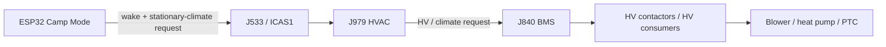
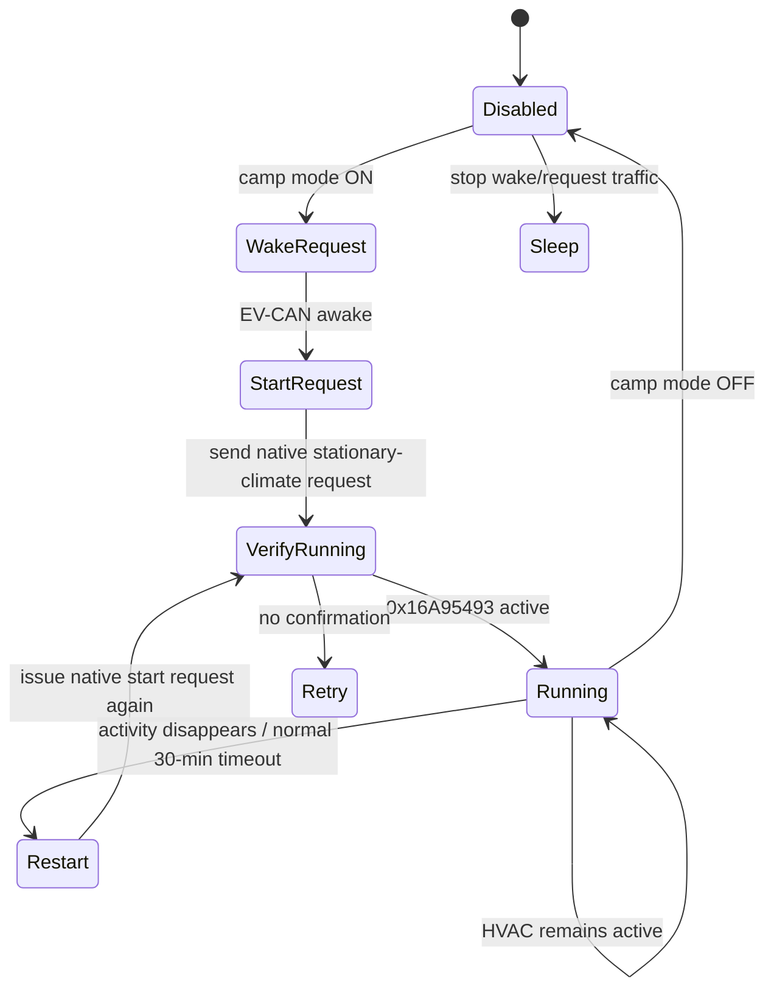
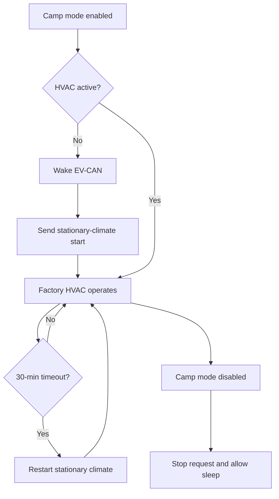

# Volkswagen MEB CAN-Only Camping Mode / Continuous Stationary Climate

**Target vehicle:** Volkswagen ID.4 E21, early MEB generation  
**Primary vehicle context:** ID.4 Pro Performance MY2021  
**Goal:** Run cabin heating/air conditioning for long periods while the vehicle remains parked **without keeping normal ignition / KL15 on**.  
**Last updated:** 2026-08-23

> [!IMPORTANT]
> This document intentionally focuses on a CAN-based stationary-climate solution rather than the J533 "disable 30-minute shutdown" adaptation. That adaptation can keep the whole vehicle in an ignition/Comfort Ready type state, which is not the desired behavior here.
>
> The desired end state is:
>
> - ignition / KL15: OFF
> - exterior lighting: normal parked behavior
> - infotainment / cluster: allowed to sleep
> - traction system: not drive-ready
> - HVAC: running
> - high-voltage system: awake only as required by stationary HVAC
> - HVAC automatically restarted if Volkswagen's normal stationary-climate timer expires

---

# 1. Executive summary

A CAN-only camp mode on the MEB platform looks technically plausible.

The strongest currently known frame is:

```text
0x16A954FB  Standklima_01
```

On a real ID.4 EV-CAN capture, this message contains:

- requested cabin temperature,
- stationary-climate active/inactive state,
- additional currently undecoded climate fields.

Known examples:

```text
Heating ON, LO:
00 00 90 02 1A 00 00 00

Heating OFF, LO:
00 00 00 00 18 00 00 00

Heating ON, HI:
00 40 97 02 1A 00 00 00

Heating OFF, HI:
00 40 07 00 18 00 00 00
```

The temperature code is decoded as:

```c
uint8_t requested_cabin_temperature =
    ((data[2] & 0x0F) << 2) |
    ((data[1] & 0xC0) >> 6);
```

The 30 documented codes are:

```text
0   LO
1   16.0 C
2   16.5 C
...
28  29.5 C
29  HI
```

A second observed message:

```text
0x16A95493
```

has:

```text
byte 0 = 0x01  when stationary heating is active
byte 0 = 0x00  when inactive
```

These two frames make it possible to build a good passive detector for whether stationary climate is running.

What is **not yet proven** is whether simply injecting `0x16A954FB` is sufficient to make the real vehicle start stationary climate. The frame may be:

- the actual command,
- a state/request published by J979 after another controller has activated HVAC,
- or part of a multi-message state machine.

The next job is therefore to capture a real remote-climate start and determine which message is causally first.

---

# 2. Why CAN instead of the camping-mode adaptation

A known MEB adaptation can disable the normal 30-minute vehicle shutdown timer.

That solution still expects the vehicle to remain in an ignition/Comfort Ready style state. Depending on configuration, this can keep systems awake that are unnecessary for camping:

```text
cluster
infotainment
lighting logic
KL15 consumers
additional ECUs
```

The CAN-only design instead aims to reproduce Volkswagen's native **stationary climate** behavior:



That gives the car a valid reason to enable the HV system while remaining parked.

---

# 3. Relevant MEB buses

## 3.1 EV-CAN / CAN-EV

This is the most important bus for this project.

| Property | Value |
|---|---|
| Physical protocol | CAN-FD |
| Arbitration bitrate | 500 kbit/s |
| Data bitrate | 2 Mbit/s |
| Bit-rate switching | Used |
| Relevant module | **J979 – Heater and Air Conditioning Control Module** |
| Relevant module | **J840 – Battery regulation / BMS** |
| Existing ESP32 connection | Yes |

The current ESP32 project already connects here.

Known J533 T40a connection used by the existing installation:

| J533 T40a pin | Signal |
|---:|---|
| 15 | CAN-EV CAN-L |
| 16 | CAN-EV CAN-H |
| 31 | Ground |
| 11 | +12 V, if appropriately protected/regulated |

Do not add another 120-ohm termination when tapping the installed vehicle bus.

---

# 4. Known stationary-climate messages

## 4.1 `0x16A954FB` — `Standklima_01`

**Confidence: High that the ID and climate fields are real; activation direction still needs confirmation.**

| Property | Value |
|---|---|
| CAN ID | `0x16A954FB` |
| Identifier type | Extended 29-bit |
| Frame | CAN-FD |
| DLC | 8 |
| Observed interval | approximately 500 ms |
| Bus | **EV-CAN / CAN-EV** |
| Known function | Stationary-climate state/request + cabin setpoint |

A real pre-2024 ID.4 capture reported the frame continuously at roughly 500 ms.

### Temperature bitfield

```c
uint8_t temp_code =
    ((data[2] & 0x0FU) << 2) |
    ((data[1] & 0xC0U) >> 6);
```

Equivalent encoding:

```c
data[1] =
    (data[1] & 0x3FU) |
    ((temp_code & 0x03U) << 6);

data[2] =
    (data[2] & 0xF0U) |
    ((temp_code >> 2) & 0x0FU);
```

### Temperature mapping

| Code | Setpoint |
|---:|---|
| 0 | LO |
| 1 | 16.0 °C |
| 2 | 16.5 °C |
| 3 | 17.0 °C |
| 4 | 17.5 °C |
| 5 | 18.0 °C |
| 6 | 18.5 °C |
| 7 | 19.0 °C |
| 8 | 19.5 °C |
| 9 | 20.0 °C |
| 10 | 20.5 °C |
| 11 | 21.0 °C |
| 12 | 21.5 °C |
| 13 | 22.0 °C |
| 14 | 22.5 °C |
| 15 | 23.0 °C |
| 16 | 23.5 °C |
| 17 | 24.0 °C |
| 18 | 24.5 °C |
| 19 | 25.0 °C |
| 20 | 25.5 °C |
| 21 | 26.0 °C |
| 22 | 26.5 °C |
| 23 | 27.0 °C |
| 24 | 27.5 °C |
| 25 | 28.0 °C |
| 26 | 28.5 °C |
| 27 | 29.0 °C |
| 28 | 29.5 °C |
| 29 | HI |

### Captured payloads

```text
Heating ON, LO
00 00 90 02 1A 00 00 00

Heating OFF, LO
00 00 00 00 18 00 00 00

Heating ON, HI
00 40 97 02 1A 00 00 00

Heating OFF, HI
00 40 07 00 18 00 00 00
```

### ON/OFF delta visible in these captures

For the same setpoint, ON vs OFF changes:

```text
byte 2: +0x90
byte 3: +0x02
byte 4: 0x18 -> 0x1A
```

Example at LO:

```text
OFF  00 00 00 00 18 00 00 00
ON   00 00 90 02 1A 00 00 00
          ^^ ^^ ^^
```

Do **not** yet assume that any one of these bits is the sole "start" bit. They may represent multiple independent states such as:

- stationary climate active,
- heating/cooling permission,
- HV request,
- blower request,
- remote-climate state.

The correct way to decode them is to gather captures across multiple scenarios.

---

## 4.2 Candidate synthesized setpoints

The setpoint packing lets us predict payloads, but these should be verified by capture before transmission.

### Example: 20.0 °C

Temperature code:

```text
9
```

Bit packing:

```text
byte 1 bits 7:6 = 01 -> 0x40
byte 2 low nibble = 2
```

If the observed ON pattern remains constant:

```text
Candidate 20.0 °C ON:
00 40 92 02 1A 00 00 00
```

### Example: 22.0 °C

Temperature code:

```text
13
```

Candidate:

```text
00 40 93 02 1A 00 00 00
```

Again: **capture these exact setpoints from the car before using the synthesized values.**

---

# 5. Important discrepancy: Battery-Emulator `Standklima_01`

The Battery-Emulator MEB implementation also defines:

```text
ID:      0x16A954FB
Payload: 00 C0 02 00 00 00 00 00
```

and comments it as:

```text
"Climate, request to BMS for starting preconditioning"
```

It transmits this frame every 500 ms in its emulated MEB environment.

This is useful proof that the frame participates in the BMS/climate state machine, but **that static emulator payload is not a known "turn cabin HVAC on" payload**.

If interpreted using the cabin-temperature decoder:

```text
00 C0 02 ...
```

encodes:

```text
temperature code 11 -> 21.0 °C
```

but it does not contain the same ON-state bit pattern as the real-car examples above.

Conclusion:

> Do not replay the Battery-Emulator static frame as the camp-mode start command. Use real vehicle captures.

---

# 6. `0x16A95493` — stationary-climate activity feedback

**Confidence: Strong real-car observation**

| Property | Value |
|---|---|
| CAN ID | `0x16A95493` |
| Identifier | Extended 29-bit |
| Bus | EV-CAN |
| Function | Climate activity/status candidate |

Observed:

```text
data[0] == 0x01 -> heating active
data[0] == 0x00 -> heating inactive
```

This is an excellent candidate for the camp-mode watchdog:

```c
bool stationary_climate_active =
    frame_16A95493.data[0] == 0x01;
```

Before relying on it, test:

- cabin cooling,
- cabin heating,
- plugged in,
- unplugged,
- scheduled departure climate,
- immediate climate,
- HVAC timeout.

It is possible that `0x01` specifically means heating rather than all HVAC activity.

---

# 7. EV-CAN network-management frames

Stationary climate must wake enough of the vehicle network to operate J979, J840, DC/DC and HV consumers.

MEB uses extended network-management messages in the `0x1B0000xx` range.

## 7.1 `0x1B000010` — gateway/network wake candidate

A real MEB climate reverse-engineering project reports:

> the EV-CAN bus wakes with a message on `0x1B000010`

Battery-Emulator names this:

```text
NMH_Gateway
```

| Property | Value |
|---|---|
| ID | `0x1B000010` |
| Identifier | Extended 29-bit |
| Frame | Classic CAN frame on the EV-CAN physical network |
| Role | Network management / wake state |

This is likely required when starting climate from a sleeping car.

Do not assume that simply transmitting one copy is enough. Capture:

- first wake frame,
- repetition rate,
- duration,
- all byte changes,
- whether another ECU takes over network management.

---

## 7.2 `0x1B000046` — `NMH_Klima`

Battery-Emulator defines:

```text
ID: 0x1B000046
Payload:
00 40 08 01 00 00 00 00
```

| Property | Value |
|---|---|
| Identifier | Extended 29-bit |
| Frame | Classic CAN |
| Example rate in emulator | 200 ms |
| Name | `NMH_Klima` |
| Role | HVAC network-management state |

This is likely not the user's HVAC command itself. It is a keep-awake/network-state message for the climate control node.

---

# 8. Other relevant EV-CAN climate/thermal frames

## 8.1 `0x1A55552B` — `Klima_EV_06`

Battery-Emulator description:

```text
Climate, heatpump and priorities
```

Example:

```text
ID:      0x1A55552B
EXT:     yes
FD:      yes
DLC:     8
Payload: 00 00 00 A0 02 04 00 30
```

This is emitted every 500 ms in the emulator.

Potentially useful for determining:

- heat-pump request,
- HVAC power priority,
- cabin-vs-battery thermal priority,
- stationary HVAC state.

Public bit definitions are not yet known.

---

## 8.2 `0x12DD5513` — `Klima_EV_07`

Battery-Emulator description:

```text
PTC / EKK voltage-free-or-not state
```

Example stub frame:

```text
ID:      0x12DD5513
EXT:     yes
FD:      yes
DLC:     8
Payload: 00 00 00 00 00 00 00 00
```

This should be captured on the real car while:

- heating cabin,
- cooling cabin,
- HVAC off,
- battery heating,
- AC charging.

---

## 8.3 `0x569` — `HVEM_04`

Battery-Emulator:

```text
ID:      0x569
EXT:     no
FD:      yes
DLC:     8
Payload: 00 00 01 3A 00 00 00 00
```

Comment:

```text
Battery heating requests
```

Even if not directly used by camp mode, this is useful for observing whether the HV energy manager considers the climate request active.

---

## 8.4 `0x16A954B4` — `eTM_01`

Battery-Emulator:

```text
ID:      0x16A954B4
EXT:     yes
FD:      yes
DLC:     8
Payload: FE B6 0D 00 00 D5 48 FD
```

Comment:

```text
eTM, cooling valves and pumps for BMS
```

Do not replay this static payload into a real car. It is useful as an ID to monitor.

---

## 8.5 `0x5E1` — `Klima_Sensor_02`

The public Volkswagen/MEB DBC defines climate sensor information here, including signals such as:

- outside temperature,
- heating pump status,
- compressor-related state,
- PTC heater state,
- compressor current.

This gives independent confirmation that actual thermal hardware started.

---

# 9. Proposed camp-mode architecture



The controller should **not** continuously spoof ignition.

---

# 10. Desired implementation behavior

```c
typedef enum {
    CAMP_DISABLED,
    CAMP_WAKE,
    CAMP_START,
    CAMP_VERIFY,
    CAMP_RUNNING,
    CAMP_RETRY,
    CAMP_STOP
} camp_state_t;
```

High-level logic:

```c
if (!camp_enabled) {
    stop_stationary_climate_if_we_started_it();
    allow_network_to_sleep();
    return;
}

if (!vehicle_in_park || vehicle_speed > 0) {
    disable_camp_mode();
    return;
}

if (!ev_can_awake) {
    request_ev_can_wake();
}

if (!stationary_climate_active()) {
    send_stationary_climate_start(target_temperature);
}

if (stationary_climate_active()) {
    // Do not spam start requests.
    // Observe factory HVAC operation.
}
```

Recommended guard conditions:

```text
gear == P
vehicle speed == 0
SOC > configurable minimum
no critical HV fault
no crash state
camp mode explicitly enabled
```

---

# 11. Reverse-engineering plan

## Phase 1 — passive unrestricted logger

Temporarily configure the ESP32 to log **all** EV-CAN traffic.

Record:

```text
timestamp_us
CAN ID
11/29-bit
classic/FD
BRS
DLC
payload
```

Do not filter only the currently known battery-heating IDs.

Recommended CSV:

```text
timestamp_us,id,ext,fd,brs,dlc,data
```

---

## Phase 2 — capture the native start transition

Best test:

```text
Vehicle:
- P
- ignition OFF
- HVAC OFF
- doors locked or normal parked state
- EV-CAN settled

Then:
- start immediate climate from Volkswagen app
```

Capture at least:

```text
T - 10 s
T + 30 s
```

Look for:

1. first network-management wake,
2. new frame IDs,
3. frames whose payload changes before `Standklima_01` becomes active,
4. changes to `0x16A954FB`,
5. `0x16A95493` transition,
6. BMS/HV state changes.

---

## Phase 3 — explicit OFF transition

While stationary climate is running:

```text
VW app -> Stop climate
```

Capture:

```text
T - 5 s
T + 15 s
```

The ideal command candidate will exhibit an inverse transition.

---

## Phase 4 — natural timeout

Let the car stop climate naturally after the normal time limit.

Capture:

```text
last 2 minutes before timeout
first 60 seconds after timeout
```

Questions:

- Does `0x16A954FB` switch itself to an OFF payload?
- Does another frame command it to stop first?
- Does `0x16A95493` drop before or after `Standklima_01` changes?
- Does network management go to sleep immediately?
- Does J840 release HV before or after J979 stops?

---

# 12. Differential-analysis method

For every CAN ID, compute:

```text
frames/second before event
frames/second after event
which bytes changed
which bits changed
time of first transition relative to visible HVAC start
```

Useful ranking metric:

```text
score =
    event_correlation
  + first-change proximity
  + repeatability
  - background entropy
```

Compare several starts:

```text
capture_start_1
capture_start_2
capture_start_3
```

The genuine command should repeat predictably.

---

# 13. Temperature differential captures

Repeat native climate starts with:

```text
LO
16.0 C
20.0 C
22.0 C
25.0 C
29.5 C
HI
```

The already-known `Standklima_01` field should change in a perfectly predictable way.

That lets us distinguish:

- setpoint bits,
- on/off bits,
- unrelated rolling state,
- heating/cooling mode flags.

---

# 14. Heating vs cooling comparison

Perform separate captures with environmental conditions that cause:

```text
heating
cooling
fan-only / low demand if possible
```

The current examples are explicitly described as "heating".

A true camp mode must work for both winter and summer.

Determine whether:

```text
0x16A95493 byte0 == 1
```

means:

```text
generic stationary HVAC active
```

or specifically:

```text
heating active
```

---

# 15. Charging-state comparison

Capture stationary HVAC in four combinations:

| Plug state | Charging | Climate |
|---|---|---|
| unplugged | no | off/on |
| plugged | no | off/on |
| plugged | AC charging | off/on |
| plugged | DC charging | off/on, only if appropriate/safe |

Especially compare the 30-minute shutdown behavior during AC charging.

There may be different energy-management permissions while a cable is connected.

---

# 16. Replay strategy

Once the start request is identified:

### Step 1

Replay only while:

```text
car stationary
P selected
HVAC currently off
```

### Step 2

Send the **minimum set of factory-equivalent frames**.

Avoid reproducing all of Battery-Emulator's thermal-management traffic. On the real car, the OEM ECUs should generate the downstream frames themselves.

### Step 3

Verify success from independent signals:

```text
0x16A95493
0x16A954FB
compressor/PTC state
HV state
blower behavior
```

### Step 4

Stop transmitting and verify that the factory state machine behaves normally.

---

# 17. Network-management caution

A poor implementation could accidentally keep the **entire vehicle network awake** all night.

The desired approach is:

```text
wake only enough network for stationary climate
       +
let factory network management run
       +
only refresh whatever the real app activation refreshes
```

Measure 12-V system current during testing.

If the ESP32 continuously transmits a gateway-style network-management frame, it may prevent ECUs from sleeping that Volkswagen normally allows to sleep.

---

# 18. Likely final implementation

Best-case discovery:

```text
0x1B000010 wake
      ↓
unknown high-level stationary-climate request
      ↓
J979 starts
      ↓
0x16A954FB changes to ON
      ↓
0x16A95493 = active
```

Then camp mode can work as:



---

# 19. Known-message table

| ID | Name | Bus | Format | Known role | Confidence |
|---|---|---|---|---|---|
| `0x16A954FB` | `Standklima_01` | EV-CAN | 29-bit CAN-FD | Cabin setpoint + stationary climate state/request | **High** |
| `0x16A95493` | unknown | EV-CAN | 29-bit, likely FD | Active state feedback | **Strong** |
| `0x1B000010` | `NMH_Gateway` | EV-CAN | 29-bit classic | Network management / bus wake | **Strong** |
| `0x1B000046` | `NMH_Klima` | EV-CAN | 29-bit classic | Climate network-management state | **Strong** |
| `0x1A55552B` | `Klima_EV_06` | EV-CAN | 29-bit CAN-FD | Climate / heat-pump / priorities | **Strong** |
| `0x12DD5513` | `Klima_EV_07` | EV-CAN | 29-bit CAN-FD | PTC/EKK/HV climate state | **Strong** |
| `0x569` | `HVEM_04` | EV-CAN | 11-bit CAN-FD | HV energy/thermal request | **Strong** |
| `0x16A954B4` | `eTM_01` | EV-CAN | 29-bit CAN-FD | Thermal-management pumps/valves | **Strong** |
| `0x5E1` | `Klima_Sensor_02` | routed MEB traffic | 11-bit | Climate sensor/hardware state | **Useful observer** |

---

# 20. Open questions

1. Which ECU is the native publisher of `0x16A954FB`?
2. Is `0x16A954FB` itself sufficient to start stationary climate?
3. Which exact bits encode HVAC enable, heating/cooling, remote/stationary mode and HV permission?
4. Does `0x16A954FB` require any counter/CRC/E2E protection?
5. What is the exact wake sequence from a completely sleeping vehicle?
6. Does the car accept a locally injected request if telematics/J533 did not originate it?
7. Is a request edge enough, or must the command be repeated?
8. Which ECU owns the 30-minute timer?
9. Does AC charging use a different timeout owner?
10. Can the factory timeout simply be reset while HVAC continues, avoiding a visible restart?
11. Can the setpoint be changed dynamically without restarting stationary climate?
12. What does `0x16A95493` represent during cooling?

---

# 21. Sources

## Primary / vehicle-specific reverse engineering

### jagheterfredrik — meb-preheat

https://github.com/jagheterfredrik/meb-preheat

Particularly:

https://github.com/jagheterfredrik/meb-preheat/blob/main/NOTES.md

Important findings used here:

- EV-CAN J533 T40a pins 15/16
- `0x1B000010` network wake observation
- `0x16A954FB` stationary climate / cabin temperature decode
- ON/OFF LO/HI payload examples
- `0x16A95493` active-state observation

## Battery-Emulator

https://github.com/dalathegreat/Battery-Emulator

Relevant files:

```text
Software/src/battery/MEB-BATTERY.h
Software/src/battery/MEB-BATTERY.cpp
```

Important IDs:

```text
Standklima_01  0x16A954FB
ORU_01         0x1A555548
Klima_EV_06    0x1A55552B
Klima_EV_07    0x12DD5513
HVEM_04        0x569
eTM_01         0x16A954B4
NMH_Gateway    0x1B000010
NMH_Klima      0x1B000046
```

## ID.4 CAN topology

Gorgias — VW ID.4 ICAS1 Vehicle Control Analysis:

https://gorgias.me/posts/vw-id4-vehicle-control-analysis/

## OpenDBC

https://github.com/commaai/opendbc

MEB DBC:

https://github.com/commaai/opendbc/blob/master/opendbc/dbc/generator/volkswagen/_vw_meb_common.dbc

## Volkswagen technical documentation

Volkswagen SSP 718 — The ID.4:

https://esperformance.net/ssp/vw/SSP_718_EN.pdf

Volkswagen ID.4 New Model Overview / SSP 891213:

https://static.nhtsa.gov/odi/tsbs/2021/MC-10189712-0001.pdf

Volkswagen ID.4 High-Voltage System / SSP 811213:

https://static.nhtsa.gov/odi/tsbs/2021/MC-10186407-0001.pdf

ID.4 wiring diagrams:

https://de.ifixit.com/Document/Xll2UsH2BgbxaJns/VW-ID4-Wiring-Diagrams-Eng.pdf

---

# 22. Immediate next experiment

The highest-value next capture is:

```text
1. Let vehicle become parked with ignition OFF and HVAC OFF.
2. Start unrestricted EV-CAN logging.
3. Wait 10 s.
4. Start immediate climate from the Volkswagen app.
5. Record 30 s.
6. Stop climate from the app.
7. Record another 15 s.
```

Then inspect first:

```text
0x1B000010
0x16A954FB
0x16A95493
0x1A55552B
0x12DD5513
0x569
0x16A954B4
```

and diff **all other IDs** around the exact start/stop timestamps.

That should tell us whether `Standklima_01` is the upstream start request or a downstream state generated after a still-unknown command.
