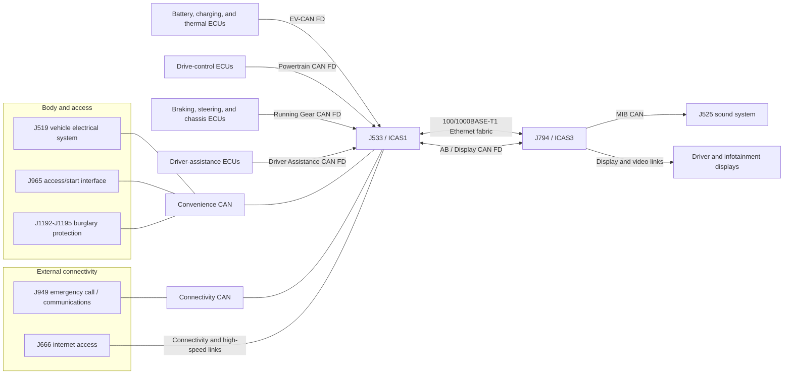
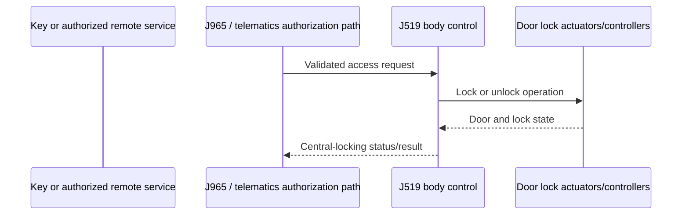

# MEB Vehicle Networks and Modules

Last reviewed: 2026-08-19

## Scope

This document describes the first-generation Volkswagen MEB/E3 vehicle
network at the level needed to plan MEB Commander hardware and research. It
focuses on the relationship between the CAN domains, J533/ICAS1, J794/ICAS3,
and the in-vehicle Ethernet network.

The Volkswagen ID.4 is the primary reference. Exact modules, connector pins,
bus branches, software partitions, and network routing vary by model, model
year, equipment, market, and software generation. This is a logical topology,
not a replacement for VIN-specific wiring diagrams.

## Topology at a Glance

MEB does not use one vehicle-wide CAN bus. It uses several electrically and
logically separate CAN domains, with J533/ICAS1 acting as a central computer
and controlled gateway. Higher-bandwidth modules are also connected through a
switched Ethernet fabric.



The diagram groups functions and omits many ECUs. It must not be used as a
connector pinout. In particular, an arrow to ICAS1 does not mean that ICAS1
transparently repeats every message onto every other bus.

## Network Summary

Volkswagen's ID.4 training material lists communication systems ranging from
500 kbit/s CAN to 1 Gbit/s Ethernet. On the 2 Mbit/s CAN-FD networks, the
nominal/arbitration phase is normally 500 kbit/s and the data phase is
2 Mbit/s.

| Network | Link type and rate | Main purpose and example participants | MEB Commander relevance |
| --- | --- | --- | --- |
| EV-CAN | CAN FD, 500 kbit/s arbitration and 2 Mbit/s data | High-voltage battery, charging, and thermal-management traffic; J840 battery-management controller | Current preheating and battery-telemetry interface |
| Battery CAN | Classical CAN, 500 kbit/s | Battery-management subnetwork between J840 and battery-internal controllers | Inside the high-voltage battery domain; not a Commander connection target |
| Powertrain CAN | CAN FD, 500 kbit/s arbitration and 2 Mbit/s data | Electric drive and propulsion coordination | Safety-critical; not currently used |
| Running Gear CAN | CAN FD, 500 kbit/s arbitration and 2 Mbit/s data | Braking, steering, parking, and chassis control | Safety-critical; not currently used |
| Driver Assistance CAN | CAN FD, 500 kbit/s arbitration and 2 Mbit/s data | Radar, camera, and driver-assistance coordination | Safety-critical; not currently used |
| Convenience CAN | Classical CAN, 500 kbit/s | Body, access/start, central locking, alarm, wake, and convenience state; J519, J965, and J1192-J1195 appear in Volkswagen's overview | Planned second, isolated CAN interface for listen-only lock research |
| Connectivity CAN | Classical CAN, 500 kbit/s | Telematics and external-connectivity coordination; J949 and J666 | Relevant to understanding the official remote-control path, not currently used |
| MIB CAN | Classical CAN, 500 kbit/s | Infotainment-side control, including ICAS3/J794 and the J525 sound system | Not currently used |
| AB / Display CAN | CAN FD, 500 kbit/s arbitration and 2 Mbit/s data | Display and operating functions between the central computers and display-side modules | Not currently used |
| Multifunction Steering Wheel CAN | Classical CAN, 500 kbit/s | Steering-wheel controls and their local interface | Not currently used |
| Ethernet | Switched 100 Mbit/s and 1 Gbit/s links | High-bandwidth central-computer, diagnostics, update, connectivity, and selected sensor/display traffic | Research only; current hardware has no automotive-Ethernet interface |
| LIN | Low-speed master/slave serial sub-buses | Local actuators and sensors attached beneath a CAN ECU, such as switches, motors, lighting, and climate flaps | A local sub-bus, not a substitute for attaching to the correct CAN domain |
| LVDS and other display links | Point-to-point high-speed serial links | Uncompressed or lightly processed display/video transport | Not a general vehicle-control network |

The labels are functional domains, not interchangeable names for the same
wires. For example, EV-CAN and Convenience CAN may both have a 500 kbit/s
arbitration/nominal rate, but they have different physical pairs, participants,
frame formats, traffic, wake behavior, and gateway permissions.

## Important Modules and Their Connections

### J533 / ICAS1

J533 is named **Data Bus On Board Diagnostic Interface** in Volkswagen
documentation and is also the first In-Car Application Server, **ICAS1**. It
is more than a traditional CAN gateway:

- It retains controlled gateway and diagnostic-routing functions.
- It is a body-domain high-performance computer running vehicle functions.
- It coordinates battery charging management and over-the-air update
  distribution.
- It connects multiple CAN domains and contains extensive 100BASE-T1 and
  1000BASE-T1 Ethernet switching/connectivity.
- It exposes multiple logical software/diagnostic systems. The ID.4 overview
  names 8123 as an Adaptive application-server system, 8124 as a Java system,
  and C002/C003 as embedded and housekeeping software clusters.

Continental describes ICAS1 as an Adaptive-AUTOSAR-based, service-oriented
vehicle server whose gateway function is only one part of the unit. Its
hardware contains two controllers and multiple Ethernet switches. This is why
`J533`, `gateway`, and `ICAS1` can refer to the same physical assembly while
describing different responsibilities.

ICAS1 is a policy boundary. It may route a diagnostic request or a configured
signal between networks, but it does not behave like an unmanaged bridge. A
frame injected on EV-CAN is not automatically reproduced on Convenience CAN.

### J794 / ICAS3

J794 is **Information Electronics Control Module 1** and is also **ICAS3**, the
central infotainment computer. Volkswagen's topology identifies its 5F
information-electronics display control and 8125 infotainment application
server as logical systems.

ICAS3 is associated with infotainment, navigation, media, audio, user
interaction, and display generation. Depending on the function, it exchanges
data over the Ethernet fabric, AB/Display CAN FD, MIB CAN, and dedicated
display/video links. It is a peer central computer, not another name for
ICAS1.

### J519, J965, and Central Locking

J519 is the **Vehicle Electrical System Control Module**. It coordinates body
and convenience functions and is an important participant in the central
locking path. J965 is the **Access/Start System Interface**, associated with
key and access authorization. The J1192-J1195 modules provide burglary
protection functions where fitted.

The supported access path involves authorization and vehicle state, not only
a lock bit:



The exact key path and the remote-telematics path are different, but both
include more state and authorization than a naked CAN flag. In the public MEB
DBC research, `0x583` is the 11-bit CAN identifier of the `ZV_02`
central-locking **status** frame on Convenience CAN. It is not a module
address and is not, by itself, an unlock command. See
[CAN_LOCK_UNLOCK_RESEARCH.md](CAN_LOCK_UNLOCK_RESEARCH.md) for the evidence and
validation plan.

### Connectivity Modules

J949 is the emergency-call and communication unit; J666 is the internet access
control module. Volkswagen's high-level topology places these functions in
the connectivity area beside ICAS1. They provide the vehicle's path toward
mobile services, but public architecture documents do not define a reusable
local remote-lock API.

An official app command can arrive over mobile connectivity, be authorized in
the manufacturer's backend/vehicle software, and then cause an internal body
request. That does not imply that the externally authenticated request and its
credentials exist as a replayable CAN or Ethernet packet.

### J840 and the Battery Networks

J840 is the high-voltage battery-management controller. It participates in
EV-CAN for vehicle-level battery, charging, and thermal coordination and has a
separate battery-internal network for lower-level battery controllers.

MEB Commander currently connects to EV-CAN after the vehicle gateway. It does
not connect to the battery-internal CAN and must never be connected to the
orange high-voltage wiring.

## How CAN Traffic Is Formatted

CAN and CAN FD are message-oriented broadcast networks. A receiver normally
interprets a frame using all of the following:

- The physical bus on which it was observed.
- The 11-bit standard or 29-bit extended CAN identifier.
- Classical-CAN or CAN-FD format and the data-length code.
- The payload bytes and their bit-level signal definitions.
- Counters, checksums, freshness values, source state, and timing.

Classical CAN carries up to 8 payload bytes per frame. CAN FD carries up to 64
payload bytes and can switch to a faster data-phase bitrate. The CAN identifier
participates in arbitration; it is not necessarily an ECU address. Two
different buses can legally reuse the same identifier for unrelated messages.

This is why `0x583` only has meaning together with “Convenience CAN, MEB
vehicle variant, and ZV_02 message definition.”

## What the MEB Ethernet Network Is Used For

Ethernet supplies bandwidth and software-oriented communication that would be
awkward or too slow on 500 kbit/s CAN. The architecture uses or enables these
functions:

- High-throughput communication between central computers and selected ECUs.
- A backbone for ICAS1's service-oriented applications.
- A high-speed workshop diagnostic and programming path; Diagnostics over IP
  (DoIP) is the standardized automotive transport for this purpose.
- Reception and distribution of software/update data. Volkswagen states that
  an update delivered by mobile data to the ICAS computers can reach up to 35
  control units, although not every target ECU is necessarily reached over an
  Ethernet link.
- Connectivity, infotainment, display, camera, logging, and other
  high-bandwidth functions, depending on the specific physical link.

Volkswagen's overview shows both 100 Mbit/s and 1 Gbit/s Ethernet plus an
Ethernet switch/bridge around ICAS1 and ICAS3. Continental's ICAS1 hardware
description confirms extensive 100BASE-T1 and 1000BASE-T1 connectivity and
multiple on-board switches.

The public high-level documents do not publish a complete port-to-protocol map
for every MEB variant. Do not assume that every camera, display, or telematics
module is on Ethernet in every vehicle.

## Ethernet Is a Network, Not One Message Format

“Ethernet bus” is common shorthand, but 100BASE-T1 and 1000BASE-T1 are normally
point-to-point, full-duplex links connected through switches. They are not an
electrically shared broadcast pair like high-speed CAN.

Internal automotive Ethernet uses a single balanced twisted pair per T1 link.
It is electrically different from both CAN and normal consumer
100/1000BASE-T cabling. An RJ45 computer NIC, CAN transceiver, or passive wire
splice cannot be connected directly to a T1 pair.

Ethernet traffic is layered:

| Layer | Typical MEB/automotive element | What identifies the data |
| --- | --- | --- |
| Physical | 100BASE-T1 or 1000BASE-T1 | Link speed, PHY role, and electrical encoding on one twisted pair |
| Data link | IEEE 802.3 Ethernet, optionally IEEE 802.1Q VLANs | Source/destination MAC address and EtherType |
| Network | IPv4 or IPv6, plus support protocols such as ARP/neighbor discovery | Source/destination IP address and next-header/protocol value |
| Transport | UDP or TCP | Source and destination ports |
| Application | DoIP, SOME/IP-family communication, time sync, network management, update/logging, audio/video, or manufacturer-specific protocols | Protocol-specific message type, logical address, service/method ID, or application schema |

A normal Ethernet II frame is conceptually:

```text
destination MAC | source MAC | optional VLAN tag | EtherType | payload | FCS
      6 bytes          6             4 bytes         2       variable   4
```

Capture hardware/software often removes the physical preamble and may omit the
FCS, so a packet capture may begin at the destination MAC and end at the
payload.

There is no Ethernet equivalent of saying only “message ID `0x583`.” A useful
Ethernet identification may require the VLAN, MAC addresses, IP addresses,
UDP/TCP ports, application protocol, application message identifier, and
software version.

## DoIP Data Format

Diagnostics over IP is standardized by ISO 13400 and implemented in AUTOSAR.
It transports discovery, routing activation, and diagnostic messages over IP.
Vehicle discovery/announcement functions use UDP, while an activated
diagnostic session and diagnostic message payloads use TCP.

Every DoIP message begins with an 8-byte generic header:

| Offset | Size | Field |
| --- | --- | --- |
| 0 | 1 byte | Protocol version |
| 1 | 1 byte | Inverse protocol version |
| 2 | 2 bytes | Payload type |
| 4 | 4 bytes | Payload length |
| 8 | Variable | Payload selected by the payload type |

For example, payload type `0x8001` is a diagnostic message. Its payload begins
with a 2-byte source logical address and a 2-byte target logical address,
followed by the diagnostic user data, normally a UDS request or response.

```text
Ethernet -> IP -> TCP -> DoIP header -> source/target logical address -> UDS PDU
```

DoIP is a diagnostic transport, not a guarantee of authorization. Routing
activation, diagnostic sessions, security access, component protection/SFD,
and ECU-specific preconditions can still prevent a request.

## SOME/IP Data Format

SOME/IP is an AUTOSAR service-oriented application protocol used over UDP or
TCP. It supports request/response calls, events, and notifications;
SOME/IP-SD provides service discovery and event-group subscription.

Its fixed 16-byte base header contains:

| Size | Field |
| --- | --- |
| 4 bytes | Message ID: 16-bit service ID plus 16-bit method/event ID |
| 4 bytes | Length |
| 4 bytes | Request ID: 16-bit client ID plus 16-bit session ID |
| 1 byte | Protocol version |
| 1 byte | Interface version |
| 1 byte | Message type |
| 1 byte | Return code |
| Variable | Serialized application payload |

The header identifies a service operation, but it does not define the payload
schema. Decoding the payload also requires the service-interface definition,
data types, byte order, optional TLV/E2E configuration, and matching software
version.

Continental describes ICAS1 as service-oriented, Adaptive-AUTOSAR-based, and
connected through Gigabit Automotive Ethernet. That makes SOME/IP-family
traffic a relevant protocol to recognize during MEB Ethernet research.
However, the public MEB topology sources used here do **not** prove that every
MEB Ethernet link uses SOME/IP or publish Volkswagen's service IDs and payload
schemas. A capture tool must first classify real traffic rather than assuming
one application protocol.

## Capturing MEB Ethernet Safely

Researching internal Ethernet requires different hardware and methods from CAN:

- Use a 100BASE-T1/1000BASE-T1 automotive Ethernet interface, media converter,
  managed switch with port mirroring, or a purpose-built full-duplex tap that
  matches the link.
- Do not attach a normal RJ45 NIC directly to the vehicle pair.
- Do not create an unmanaged inline bridge. Loss of link training, latency,
  packet loss, VLAN errors, or failed sleep/wake behavior can disable vehicle
  functions.
- A switched network only sends normal unicast traffic to the destination
  port. Splicing into another link does not expose all vehicle Ethernet
  traffic as it might on a shared CAN bus.
- Record both directions, VLAN tags, timestamps, and link metadata. Preserve
  PCAP/PCAPNG files before attempting higher-layer decoding.
- Start with a bench assembly or an approved diagnostic interface. Keep
  vehicle-installed research passive until the physical link and wake/sleep
  behavior are understood.

The ESP32-C5 has no integrated Ethernet MAC. Adding Ethernet to MEB Commander
would require an external MAC/controller path plus a compatible automotive T1
PHY or bridge and vehicle-specific coupling hardware. The existing CAN
transceivers cannot be reused. For high-rate capture and protocol discovery, a
separate automotive-Ethernet logger or computer is likely more practical than
the current microcontroller hardware.

## Implications for MEB Commander

- Keep the implemented EV-CAN interface and planned Convenience CAN interface
  physically and logically separate.
- Treat ICAS1 as a routed policy boundary, not as a transparent CAN bridge.
- Perform lock-state discovery directly on Convenience CAN in listen-only
  mode. `0x583`/`ZV_02` is a status lead, not an unlock implementation.
- Do not assume that connecting to Ethernet bypasses central-locking
  authorization. It adds more network layers and security state.
- Treat a future Ethernet interface as a separate project module with its own
  hardware, capture format, network identity, authentication, and sleep/wake
  requirements.
- Verify every endpoint and connector against VIN-specific wiring information
  before attaching hardware.

## Primary Sources

- [Volkswagen ID.4 Self Study Program 891213](https://static.nhtsa.gov/odi/tsbs/2021/MC-10189712-0001.pdf) — network names, rates, ICAS1/ICAS3 topology, and module legend.
- [Continental: Vehicle Server Connects VW ID. Electric Vehicles](https://www.continental.com/en/press/press-releases/2019-11-12-icas-vw/) — ICAS1 responsibilities, Adaptive AUTOSAR, service-oriented architecture, and Gigabit Automotive Ethernet.
- [Continental/IEEE: High-Speed Interfaces for High-Performance Computing](https://standards.ieee.org/wp-content/uploads/import/documents/other/eipatd-presentations/2020/D1-02-Hopf-HighSpeed-Interfaces-for-HighPerformance-Computing.pdf) — ICAS1 100BASE-T1/1000BASE-T1 and internal switch architecture.
- [Volkswagen: Over-the-Air Updates for the ID. Family](https://www.volkswagen-newsroom.com/en/press-releases/new-functions-and-greater-comfort-volkswagen-launches-over-the-air-updates-for-the-id-family-7285) — mobile update delivery to ICAS and distribution to vehicle ECUs.
- [AUTOSAR Diagnostic over IP specification](https://www.autosar.org/fileadmin/standards/R24-11/CP/AUTOSAR_CP_SWS_DiagnosticOverIP.pdf) — DoIP generic header, routing, and diagnostic-message format.
- [AUTOSAR SOME/IP Protocol Specification](https://www.autosar.org/fileadmin/standards/R25-11/FO/AUTOSAR_FO_PRS_SOMEIPProtocol.pdf) — SOME/IP header and protocol behavior.
- [IEEE 100BASE-T1 project description](https://www.ieee802.org/3/1TPCESG/email/msg00086.html) and [OPEN Alliance 1000BASE-T1 ECU specification](https://opensig.org/wp-content/uploads/2025/05/1000BASE-T1-Ethernet-ECU-Test-Specification-Layer-1-v1.0.pdf) — point-to-point full-duplex single-pair physical links.
- [Espressif ESP32-C5 system documentation](https://docs.espressif.com/projects/esp-idf/en/latest/esp32c5/api-reference/system/misc_system_api.html) — lack of an integrated Ethernet MAC and need for an external Ethernet interface.
