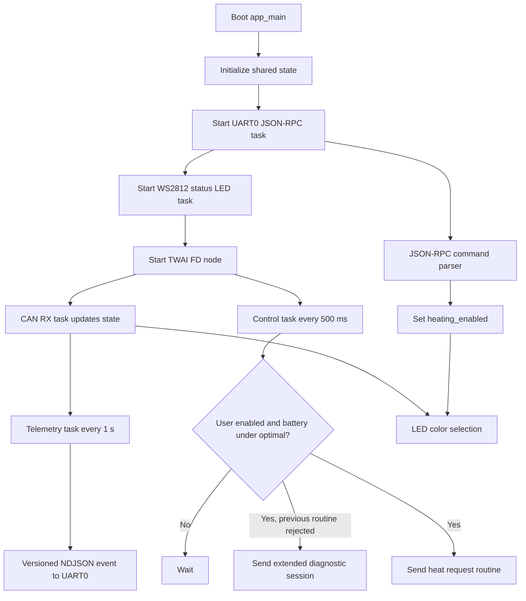
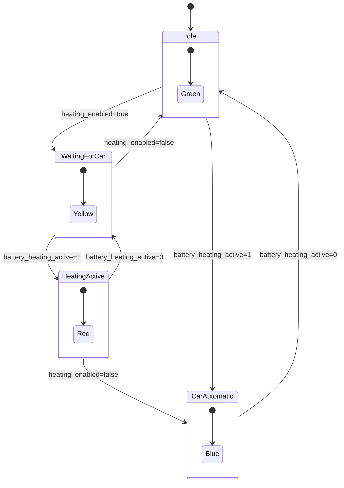
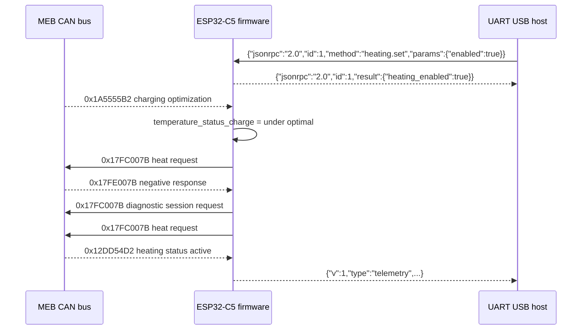

# MEB Preheat ESP32 Software

This firmware runs on an ESP32-C5 connected to a Volkswagen MEB platform CAN FD bus. It observes battery thermal status frames and, when the user enables heating over the devboard's UART USB connector, periodically sends the diagnostic routine used by the older firmware to request battery preheating.

The command channel is UART0 at 115200 bit/s through the development board's USB-to-UART bridge, usually the connector labelled `UART`. The active firmware pin mapping is defined in `main/app_config.h`. The native ESP32-C5 `USB` / USB Serial/JTAG peripheral remains enabled for normal USB-JTAG/debug enumeration, but it is not used for the JSON-RPC and telemetry protocol at this point, and there is no auxiliary USART1-style command interface.

## Runtime Flow



## Control Logic



LED meanings:

| Color | User request | Car heating active | Meaning |
| --- | --- | --- | --- |
| Green | No | No | Heating is not requested and not active. |
| Yellow | Yes | No | Heating is requested by the user, waiting for the car to turn it on. |
| Red | Yes | Yes | Heating is requested by the user and active. |
| Blue | No | Yes | The car has turned heating on by itself. |

## CAN Behavior

The TWAI node is configured for CAN FD with 500 kbit/s arbitration bitrate and 2 Mbit/s data bitrate. Transmitted request frames use extended IDs, CAN FD format, and bit rate switching.



Received CAN IDs:

| CAN ID | Purpose | State updated |
| --- | --- | --- |
| `0x17FE007B` | Diagnostic response | Detects routine/session error `03 7F 2F 7F`. |
| `0x12DD54D2` | Battery heating status | Active flag, heating/cooling request, heating power bytes. |
| `0x1A5555B2` | Charging optimization | Battery temperature status for charging. |
| `0x12DD54D0` | Dynamic charge limits | Predicted max charge power and current. |
| `0x16A954A6` | Battery temperature | Min and max battery temperature. |

Transmitted CAN frames:

| CAN ID | Data | When sent |
| --- | --- | --- |
| `0x17FC007B` | `02 10 03 00 00 00 00 00` | After a diagnostic negative response to switch session. |
| `0x17FC007B` | `07 2F 80 37 03 00 05 32` | Every 500 ms when user heating is enabled and battery temperature status is under optimal. |

## UART USB Protocol

The serial command task reads one newline-terminated JSON object per line from UART0 at 115200 8N1. On the development board, connect the cable to the `UART` USB port to use this protocol.

UART0 is also ESP-IDF's default console, so early boot messages and `ESP_LOG*` lines may appear on the same serial stream. Host software should ignore non-JSON lines and process only complete JSON objects.

Commands use JSON-RPC 2.0. Each request should include an `id`; if `id` is omitted, the request is treated as a notification and successful commands do not produce a response.

Supported methods:

```json
{"jsonrpc":"2.0","id":1,"method":"heating.set","params":{"enabled":true}}
{"jsonrpc":"2.0","id":2,"method":"heating.get"}
{"jsonrpc":"2.0","id":3,"method":"device.info"}
{"jsonrpc":"2.0","id":4,"method":"telemetry.set_interval","params":{"ms":1000}}
```

JSON-RPC success response examples:

```json
{"jsonrpc":"2.0","id":1,"result":{"heating_enabled":true}}
{"jsonrpc":"2.0","id":2,"result":{"heating_enabled":true,"active":0,"request":0,"cooling_request":0,"power_w":0,"power_req_w":0,"temperature_status":1}}
{"jsonrpc":"2.0","id":4,"result":{"interval_ms":1000}}
```

JSON-RPC error response example:

```json
{"jsonrpc":"2.0","id":4,"error":{"code":-32602,"message":"params.ms outside allowed range"}}
```

`telemetry.set_interval` accepts `params.ms` from `100` to `60000`.

The firmware also emits versioned NDJSON events. These are not JSON-RPC responses, so host software should dispatch them by `type`.

Telemetry event:

```json
{"v":1,"type":"telemetry","ts_ms":123456,"heating":{"active":0,"request":0,"cooling_request":0,"power_w":0,"power_req_w":0},"thermal":{"status":0},"predicted":{"power_kw":0.0,"current_a":0.0},"battery_temp_c":{"min":0.0,"max":0.0},"control":{"heating_enabled":false}}
```

Other events:

```json
{"v":1,"type":"device.ready","version":"0.3.0"}
{"v":1,"type":"control.diag_session_retry"}
```

## Pins

Pin defaults are defined in `main/app_config.h`.

| Signal | ESP32-C5 pin | Direction | Notes |
| --- | --- | --- | --- |
| CAN TX / TWAI TX | GPIO 4 | Output | Connect to the TXD input of the CAN FD transceiver. |
| CAN RX / TWAI RX | GPIO 5 | Input | Connect to the RXD output of the CAN FD transceiver. |
| Status LED data | GPIO 27 | Output | WS2812/NeoPixel style single RGB LED, GRB order. |
| UART0 TX | GPIO 12 | Output | Connects to the USB-UART bridge RXD input. Used for JSON-RPC responses and NDJSON telemetry at 115200 8N1. |
| UART0 RX | GPIO 11 | Input | Connects to the USB-UART bridge TXD output. Used for JSON-RPC commands at 115200 8N1. |

The native connector labelled `USB` / USB Serial/JTAG is kept enabled for debug/flash enumeration, but it is not used for this application protocol. No separate auxiliary USART1-style TX/RX command interface is implemented.

## Source Layout

| File | Responsibility |
| --- | --- |
| `main/meb-preheat.c` | App startup. |
| `main/app_config.h` | Pin, bitrate, timing, version, and CAN ID constants. |
| `main/app_state.c` | Shared state updated by CAN and read by control, telemetry, and LED tasks. |
| `main/can_bus.c` | TWAI FD setup, RX dispatch, diagnostic session TX, heat request TX. |
| `main/control.c` | Heating request state machine, versioned telemetry events, and telemetry interval setting. |
| `main/status_led.c` | Four-color LED status logic. |
| `main/serial_console.c` | UART0 JSON-RPC command parser and JSON output. |
