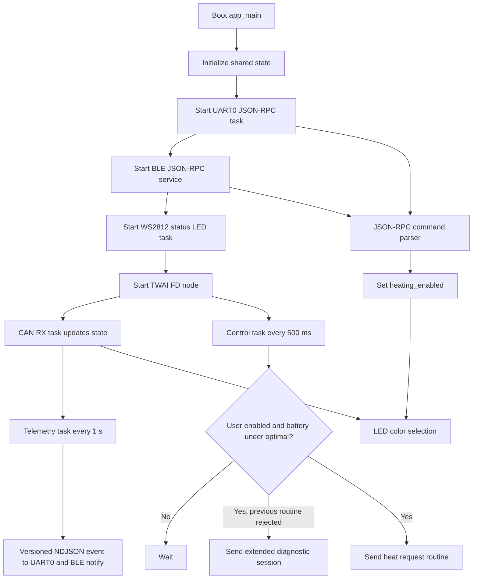
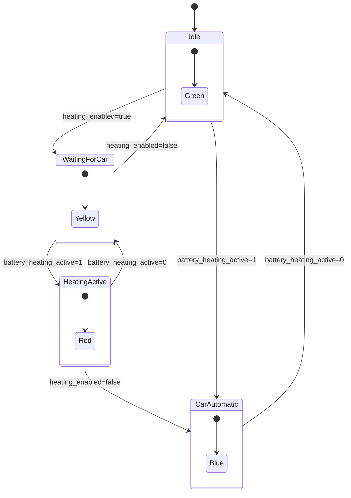
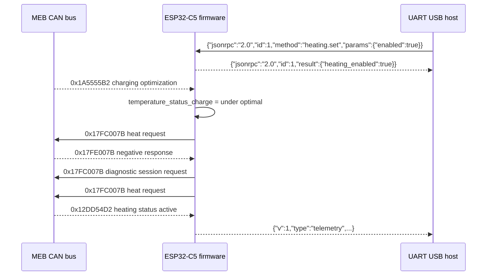

# MEB Preheat ESP32 Software

This firmware runs on an ESP32-C5 connected to a Volkswagen MEB platform CAN FD bus. It observes battery thermal status frames and, when the user enables heating over the devboard's UART USB or BLE connection, periodically sends the diagnostic routine to request battery preheating.

The command channel is UART0 at 115200 bit/s through the development board's USB-to-UART bridge, usually the connector labelled `UART`. The same newline-delimited JSON-RPC and telemetry stream is also exposed over Bluetooth LE as a custom GATT service named `MEB-Preheat`. The active firmware pin mapping is defined in `main/app_config.h`. The native ESP32-C5 `USB` / USB Serial/JTAG peripheral remains enabled for normal USB-JTAG/debug enumeration, but it is not used for the JSON-RPC and telemetry protocol at this point..

## Build Profiles

The default build is the development profile. It keeps ESP-IDF automatic light sleep, BLE sleep, and tickless idle disabled so USB-JTAG flashing/debugging remains reliable.

Production mode uses a separate generated config file and build directory:

```powershell
.\scripts\build_production.ps1
```

That command uses the normal `sdkconfig` as the base, applies `sdkconfig.defaults.production` as production overrides, writes generated config to `sdkconfig.production`, and places output under `build-production`. Production mode enables automatic light sleep and BLE modem sleep, so flash it with UART/serial if USB-JTAG becomes unreliable after the production firmware is running.

## Runtime Flow



## Control Logic



LED meanings:

| Color | User request | Car heating active | Meaning |
| --- | --- | --- | --- |
| Green | No | No | Heating is not requested and not active. |
| Yellow | Yes | No | Heating is requested by the user, waiting for the car to turn it on. |
| Red | Yes | Yes | Heating is requested by the user and active. |
| Blue | No | Yes | The car has turned heating on by itself. |

## CAN Behavior

The TWAI node is configured for CAN FD with 500 kbit/s arbitration bitrate and 2 Mbit/s data bitrate. Transmitted request frames use extended IDs, CAN FD format, and bit rate switching.



Received CAN IDs:

| CAN ID | Purpose | State updated |
| --- | --- | --- |
| `0x17FE007B` | Diagnostic response | Detects routine/session error `03 7F 2F 7F`. |
| `0x12DD54D2` | Battery heating status | Active flag, heating/cooling request, heating power bytes. |
| `0x1A5555B2` | Charging optimization | Battery temperature status for charging. |
| `0x12DD54D0` | Dynamic charge limits | Predicted max charge power and current. |
| `0x16A954A6` | Battery temperature | Min and max battery temperature. |

Transmitted CAN frames:

| CAN ID | Data | When sent |
| --- | --- | --- |
| `0x17FC007B` | `02 10 03 00 00 00 00 00` | After a diagnostic negative response to switch session. |
| `0x17FC007B` | `07 2F 80 37 03 00 05 32` | Every 500 ms when user heating is enabled and battery temperature status is under optimal. |

## UART USB Protocol

The serial command task reads one newline-terminated JSON object per line from UART0 at 115200 8N1. On the development board, connect the cable to the `UART` USB port to use this protocol.

UART0 is also ESP-IDF's default console, so early boot messages and `ESP_LOG*` lines may appear on the same serial stream. Host software should ignore non-JSON lines and process only complete JSON objects.

Commands use JSON-RPC 2.0. Each request should include an `id`; if `id` is omitted, the request is treated as a notification and successful commands do not produce a response.

Supported methods:

```json
{"jsonrpc":"2.0","id":1,"method":"heating.set","params":{"enabled":true}}
{"jsonrpc":"2.0","id":2,"method":"heating.get"}
{"jsonrpc":"2.0","id":3,"method":"device.info"}
{"jsonrpc":"2.0","id":4,"method":"device.uptime"}
{"jsonrpc":"2.0","id":5,"method":"device.reset"}
{"jsonrpc":"2.0","id":6,"method":"device.diagnostics","params":{"limit":5}}
{"jsonrpc":"2.0","id":7,"method":"device.events","params":{"limit":8}}
{"jsonrpc":"2.0","id":8,"method":"telemetry.set_interval","params":{"ms":1000}}
{"jsonrpc":"2.0","id":9,"method":"heating.set_auto_off_timer","params":{"minutes":30}}
{"jsonrpc":"2.0","id":10,"method":"firmware.status"}
```

JSON-RPC success response examples:

```json
{"jsonrpc":"2.0","id":1,"result":{"heating_enabled":true,"active":0,"request":0,"cooling_request":0,"power_w":0,"power_req_w":0,"temperature_status":1,"auto_off_timer_enabled":false,"auto_off_timer_minutes":0,"auto_off_remaining_minutes":180}}
{"jsonrpc":"2.0","id":2,"result":{"heating_enabled":true,"active":0,"request":0,"cooling_request":0,"power_w":0,"power_req_w":0,"temperature_status":1,"auto_off_timer_enabled":false,"auto_off_timer_minutes":0,"auto_off_remaining_minutes":180}}
{"jsonrpc":"2.0","id":3,"result":{"version":"0.4.0","about":"MEB preheat CAN controller","protocol_version":2,"release_build":false,"build_mode":"development","serial":{"uart":0,"baud_rate":115200,"tx_gpio":11,"rx_gpio":12},"ble":{"name":"MEB-Preheat","service_uuid":"7e57c000-f8aa-4a1f-9af3-9c0b7fd90e00","rx_uuid":"7e57c001-f8aa-4a1f-9af3-9c0b7fd90e00","tx_uuid":"7e57c002-f8aa-4a1f-9af3-9c0b7fd90e00"},"telemetry_interval_ms":1000,"heating":{"safety_auto_off_enabled":true,"safety_auto_off_minutes":180},"can":{"tx_gpio":4,"rx_gpio":5,"bitrate":500000,"data_bitrate":2000000}}}
{"jsonrpc":"2.0","id":4,"result":{"uptime_ms":123456,"reset":{"reason":1,"name":"poweron"}}}
{"jsonrpc":"2.0","id":5,"result":{"resetting":true,"delay_ms":500}}
{"jsonrpc":"2.0","id":6,"result":{"uptime_ms":123456,"reset":{"reason":1,"name":"poweron"},"heap":{"free":210000,"minimum_free":198000,"free_8bit":210000,"minimum_free_8bit":198000,"largest_free_8bit_block":120000},"event_log":{"capacity":16,"count":1,"returned":1,"overwritten":0,"events":[{"seq":1,"ts_ms":8,"c":"system","e":"boot","d":"reset=poweron","heap":226000,"min_heap":226000}]}}}
{"jsonrpc":"2.0","id":7,"result":{"capacity":16,"count":1,"returned":1,"overwritten":0,"events":[{"seq":1,"ts_ms":8,"c":"system","e":"boot","d":"reset=poweron","heap":226000,"min_heap":226000}]}}
{"jsonrpc":"2.0","id":8,"result":{"interval_ms":1000}}
{"jsonrpc":"2.0","id":9,"result":{"heating_enabled":true,"active":0,"request":0,"cooling_request":0,"power_w":0,"power_req_w":0,"temperature_status":1,"auto_off_timer_enabled":true,"auto_off_timer_minutes":30,"auto_off_remaining_minutes":30}}
```

JSON-RPC error response example:

```json
{"jsonrpc":"2.0","id":4,"error":{"code":-32602,"message":"params.ms outside allowed range"}}
```

`telemetry.set_interval` accepts `params.ms` from `100` to `60000`.

`heating.set_auto_off_timer` accepts `params.minutes`. A value greater than zero starts that many minutes of user auto-off countdown whenever heating is enabled; setting `minutes` to `0` disables the user timer. The safety auto-off limit still turns heating off after 180 minutes by default even when the user timer is disabled. Build config `MEB_DISABLE_SAFETY_AUTO_OFF` disables that safety limit, and `MEB_SAFETY_AUTO_OFF_MINUTES` changes the default 3 hour duration.

`device.uptime` returns milliseconds since the current firmware boot and the last reset reason reported by ESP-IDF. If the device disconnected because the firmware crashed and rebooted, the next connection should show a short `uptime_ms` and a reset name such as `panic`, `task_watchdog`, or `watchdog`.

`device.reset` schedules a software reset after a short delay so the JSON-RPC response can be sent first. The command has no params.

`device.diagnostics` returns uptime, reset reason, heap statistics, and a compact in-RAM event log. `device.events` returns only the event log. Both accept optional `params.limit`; diagnostics returns at most the most recent 5 events and the event-only call returns at most 8 events to keep BLE responses small. Events are intentionally compact: `c` is component, `e` is event name, `d` is detail text, and each event includes free heap and minimum free heap at the time it was recorded.

## Firmware Update Protocol

Firmware can be updated through the same newline-delimited JSON-RPC stream used by USB-to-UART and BLE. The firmware image is not sent as one large command. Instead, the host starts an OTA session, sends base64-encoded chunks, finalizes the image, then asks the device to reboot into the new partition.

The flash layout uses two OTA app slots:

| Partition | Offset | Size |
| --- | --- | --- |
| `ota_0` | `0x20000` | `0xE0000` |
| `ota_1` | `0x100000` | `0xE0000` |

Each app image must fit in one OTA slot. With the current 2 MB flash configuration, that means the firmware binary must be no larger than `917504` bytes.

Devices currently flashed with the old single-app partition table need one normal bootloader flash first so the partition table, bootloader metadata, and OTA-capable app are installed together. After that first migration, later firmware images can be delivered through `firmware.*` over USB-to-UART or BLE.

The update protocol verifies transfer integrity with a required SHA-256 digest of the complete `.bin` image. Signed firmware / secure boot is not enabled at this point, so SHA-256 only detects corruption or the wrong file; it does not prove the image came from a trusted signer.

OTA methods:

| Method | Params | Result |
| --- | --- | --- |
| `firmware.begin` | `size` in bytes, `sha256` lowercase or uppercase hex digest | OTA status |
| `firmware.write` | `offset` byte offset, `data` base64 chunk | `received`, `written`, `expected_size` |
| `firmware.end` | none | OTA status with `pending_reboot:true` |
| `firmware.cancel` | none | OTA status after aborting an active update, or clearing a pending reboot |
| `firmware.status` | none | OTA status |
| `firmware.reboot` | none | Reboots after a successfully finalized update |

OTA status example:

```json
{"active":true,"pending_reboot":false,"written":0,"expected_size":823456,"partition":"ota_1","partition_size":917504,"has_sha256":true,"max_base64_chars":768}
```

Update sequence:

```json
{"jsonrpc":"2.0","id":10,"method":"firmware.begin","params":{"size":823456,"sha256":"0123456789abcdef0123456789abcdef0123456789abcdef0123456789abcdef"}}
{"jsonrpc":"2.0","id":11,"method":"firmware.write","params":{"offset":0,"data":"base64..."}}
{"jsonrpc":"2.0","id":12,"method":"firmware.write","params":{"offset":576,"data":"base64..."}}
{"jsonrpc":"2.0","id":13,"method":"firmware.end"}
{"jsonrpc":"2.0","id":14,"method":"firmware.reboot"}
```

Host requirements:

| Requirement | Details |
| --- | --- |
| Chunk order | Chunks must be sent in strict order. `params.offset` must equal the number of raw bytes already accepted. |
| Chunk size | `params.data` can contain at most `768` base64 characters, which carries up to `576` raw bytes. The helper updater defaults to `384` raw bytes per chunk for BLE stability. Smaller chunks are allowed, including the final chunk. |
| Acknowledgement | Wait for each `firmware.write` response before sending the next chunk. This avoids overrunning the UART/BLE command queues and makes recovery deterministic. |
| BLE framing | A JSON-RPC line may be split across multiple BLE writes, but the complete JSON object must end with `\n`. |
| UART framing | Send one newline-terminated JSON object per command over the USB-to-UART bridge. |
| Recovery | If a chunk fails, query `firmware.status` and resume at the returned `written` offset, or call `firmware.cancel` and start over. |

`firmware.end` checks the received byte count, validates the SHA-256 digest, asks ESP-IDF to validate the image, and marks the new OTA partition as the next boot target. The device keeps running the old firmware until `firmware.reboot` is called or the device is otherwise reset.

The helper updater can drive this protocol over either transport:

```powershell
python -m pip install pyserial bleak
python scripts\meb_ota_update.py --serial COM5 build\meb-preheat.bin --reboot
python scripts\meb_ota_update.py --ble build\meb-preheat.bin --reboot
```

Only one program can own the USB-to-UART COM port on Windows. Close ESP-IDF Monitor, VS Code serial monitor, PuTTY, or other serial tools before running the serial updater.

## Bluetooth LE Protocol

The firmware advertises as `MEB-Preheat` and exposes the same newline-delimited JSON-RPC stream over a custom BLE GATT service:

| Item | UUID | Direction |
| --- | --- | --- |
| Service | `7e57c000-f8aa-4a1f-9af3-9c0b7fd90e00` | Discovery |
| RX characteristic | `7e57c001-f8aa-4a1f-9af3-9c0b7fd90e00` | Host writes JSON lines to ESP32-C5 |
| TX characteristic | `7e57c002-f8aa-4a1f-9af3-9c0b7fd90e00` | ESP32-C5 sends notifications to host |

The BLE transport preserves the same one-JSON-object-per-line framing used by UART. Subscribe to TX notifications, then write UTF-8 JSON plus `\n` to RX. Notifications may be split by BLE MTU; host software should concatenate notification payloads until a newline is received.

The helper client uses Python Bleak:

```powershell
python -m pip install bleak
python scripts\meb_ble_client.py --info
python scripts\meb_ble_client.py --reset
python scripts\meb_ble_client.py --diagnostics
python scripts\meb_ble_client.py --events --event-limit 8
python scripts\meb_ble_client.py --enable --watch
python scripts\meb_ble_client.py --auto-off-minutes 30
python scripts\meb_ble_client.py --auto-off-minutes 0
python scripts\meb_ble_client.py --disable
```

The firmware also emits versioned NDJSON events. These are not JSON-RPC responses, so host software should dispatch them by `type`.

Telemetry event:

```json
{"v":2,"type":"telemetry","ts_ms":123456,"heating":{"active":0,"request":0,"cooling_request":0,"power_w":0,"power_req_w":0},"thermal":{"status":0},"predicted":{"power_kw":0.0,"current_a":0.0},"battery_temp_c":{"min":0.0,"max":0.0},"control":{"heating_enabled":false,"auto_off_timer_minutes":0,"auto_off_remaining_minutes":null}}
```

Other events:

```json
{"v":2,"type":"device.ready","version":"0.4.0"}
{"v":2,"type":"control.diag_session_retry"}
{"v":2,"type":"control.heating_auto_off","reason":"safety"}
```

## Pins

Pin defaults are defined in `main/app_config.h`.

| Signal | ESP32-C5 pin | Direction | Notes |
| --- | --- | --- | --- |
| CAN TX / TWAI TX | GPIO 4 | Output | Connect to the TXD input of the CAN FD transceiver. |
| CAN RX / TWAI RX | GPIO 5 | Input | Connect to the RXD output of the CAN FD transceiver. |
| Status LED data | GPIO 27 | Output | WS2812/NeoPixel style single RGB LED, GRB order. |
| UART0 TX | GPIO 12 | Output | Connects to the USB-UART bridge RXD input. Used for JSON-RPC responses and NDJSON telemetry at 115200 8N1. |
| UART0 RX | GPIO 11 | Input | Connects to the USB-UART bridge TXD output. Used for JSON-RPC commands at 115200 8N1. |

The native connector labelled `USB` / USB Serial/JTAG is kept enabled for debug/flash enumeration, but it is not used for this application protocol. No separate auxiliary USART1-style TX/RX command interface is implemented.

## Source Layout

| File | Responsibility |
| --- | --- |
| `main/meb-preheat.c` | App startup. |
| `main/app_config.h` | Pin, bitrate, timing, version, and CAN ID constants. |
| `main/app_state.c` | Shared state updated by CAN and read by control, telemetry, and LED tasks. |
| `main/can_bus.c` | TWAI FD setup, RX dispatch, diagnostic session TX, heat request TX. |
| `main/control.c` | Heating request state machine, versioned telemetry events, and telemetry interval setting. |
| `main/diagnostics.c` | Uptime, reset reason, heap snapshot, and in-RAM event log. |
| `main/ota_update.c` | Chunked firmware update state machine using ESP-IDF OTA partitions. |
| `main/status_led.c` | Four-color LED status logic. |
| `main/serial_console.c` | UART0 JSON-RPC command parser and JSON output. |
| `main/ble_console.c` | BLE GATT RX/TX bridge for the same JSON-RPC and telemetry stream. |
| `scripts/meb_ble_client.py` | Python Bleak client for BLE JSON-RPC commands and telemetry notifications. |
| `scripts/meb_ota_update.py` | Python OTA uploader for USB-to-UART and BLE firmware updates. |
