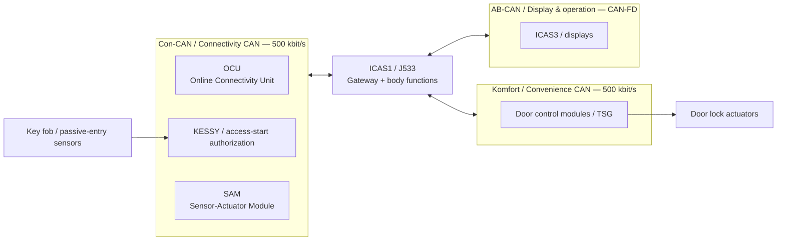
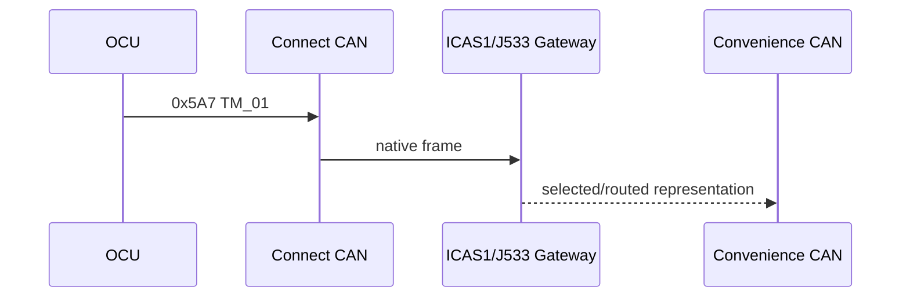
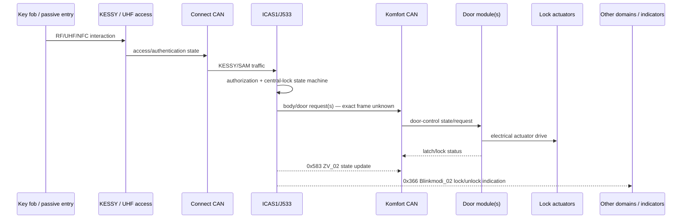
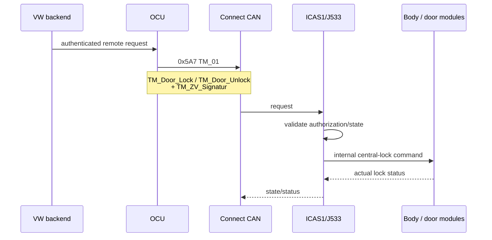
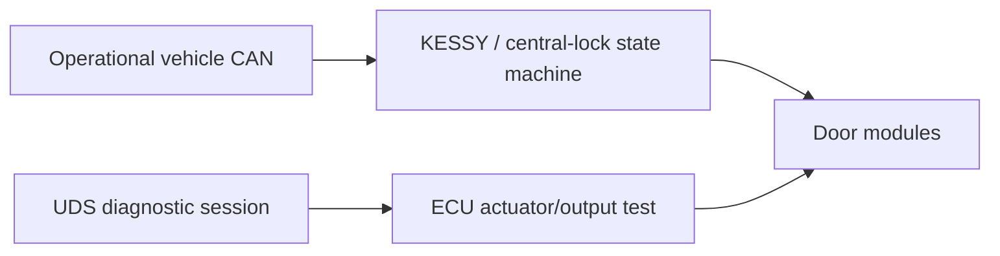

# Volkswagen ID.4 (MEB) CAN locking / unlocking research notes

**Vehicle focus:** Volkswagen ID.4 Pro Performance, model year 2021  
**Platform:** Volkswagen MEB  
**Research date:** 2026-08-22

> **Scope**
>
> This document collects publicly available information useful for *passive analysis* of the
> ID.4 central-locking system: CAN message IDs, decoded signals, likely source ECUs, bus
> placement, gateway routing, and a capture strategy.
>
> It deliberately distinguishes **observed/status traffic** from **command/request traffic**.
> Seeing a frame on a bus does not imply that replaying it on that bus will be accepted or routed.
> No public source located during this research documents how to generate the
> `TM_ZV_Signatur` authentication value.

---

## 1. Main findings

The most important finding is that MEB has a dedicated **Connectivity / Connect CAN
(Con-CAN)** for KESSY-related components and remote vehicle access. Volkswagen training
material describes this as a new 500 kbit/s CAN network for components around KESSY and
remote access to the vehicle.

Digiteq Automotive's MEB CANSim test-bench documentation gives unusually useful native-bus
information:

- `0x5A7 / TM_01` is on **MEB Connect CAN**, DLC 8, nominal 1000 ms, sender **OCU**.
- Access-related extended frames such as `UHF_Kessy_01`, `UHF_Sensor_09`,
  `NFC_MiKo_01`, and `NFC_TGS_01` are also on **Connect CAN**.
- Door/body frames such as `TGS_FT_01`, `BCM_Taster_02`, `BCM_04/05/06`,
  `ELV_01`, and `SAM_01` are on **MEB Komfort (Convenience) CAN**.
- Independent ID.4 reverse engineering reports `0x583 / ZV_02`, `0x592 / Kessy_04`,
  `0x5A7 / TM_01`, `0x366 / Blinkmodi_02`, and door-controller frames visible on
  **Convenience CAN** as well.

That apparent conflict is actually informative: **ICAS1/J533 is a gateway and routes
selected messages between domains**. Therefore a frame may originate on Connect CAN but also
be observable on Convenience CAN, with a DBC listing its transmitter as `Gateway`.

### Practical consequence

If the goal is to understand central locking, the two most useful physical buses to monitor are:

1. **Connect / Connectivity CAN** — KESSY, OCU and remote-access traffic.
2. **Komfort / Convenience CAN** — door/body control, central-lock state and door-controller traffic.

**CAN-EV is not the primary access-control network.** A logger attached only to CAN-EV is
unlikely to see the native KESSY/OCU locking exchange.

---

## 2. MEB network overview

Volkswagen's ID.4 network architecture centers on **ICAS1 / J533**, which acts as the central
gateway and hosts many body-control functions. MEB uses multiple independent CAN and CAN-FD
domains.

| Network | Typical physical layer | Relevant role |
|---|---:|---|
| **Con-CAN / Connect / Connectivity CAN** | Classic CAN, 500 kbit/s | KESSY-related components, remote vehicle access, OCU |
| **Komfort / Convenience CAN** | Classic CAN, 500 kbit/s | Door modules, body functions, ELV, central-lock traffic |
| **AB-CAN / Anzeige und Bedienung** | CAN-FD, 500 kbit/s arbitration / 2 Mbit/s data typical | Display/operation domain; receives many gateway-routed status messages |
| **CAN-EV** | CAN-FD, 500 kbit/s arbitration / 2 Mbit/s data typical | High-voltage / EV components; not the primary lock-access domain |
| **Antrieb / Powertrain CAN** | CAN-FD | Powertrain |
| **Fahrwerk / Running-gear CAN** | CAN-FD | ABS, steering, chassis |
| **FAS / Driver-assistance CAN** | CAN-FD | ADAS |

### Simplified access-control topology



The exact ECU-to-bus placement varies with MEB generation and vehicle equipment. Treat the
diagram as a working model, not a wiring diagram.

---

## 3. Message summary

| CAN ID | Name | Main relevance | Best-supported bus placement | Source / transmitter | Confidence |
|---:|---|---|---|---|---|
| `0x5A7` | `TM_01` | Telematics lock/unlock request fields + 11-bit signature | **Native: Connect CAN**; also reported routed onto Convenience CAN | **OCU** natively; `Gateway` in opendbc routed view | **High** |
| `0x583` | `ZV_02` | Central-lock actual/desired states, door-open state, SAFELOCK, key access | Convenience CAN observed; likely gateway-generated/routed | `Gateway` in opendbc | **High** for fields, **medium** for native segment |
| `0x58C` | `Klemmen_Steuerung_01` | Contains `KST_Anf_ZV_Verriegelung` ("request central locking / locking") | Confirmed on MEB AB-CAN in CANSim; may be routed elsewhere | `Gateway` | **High** for signal existence, **low/medium** as a general lock command |
| `0x366` | `Blinkmodi_02` | Lock/unlock flash-mode bits `BM_ZV_auf` / `BM_ZV_zu` | Convenience CAN observed; also AB-CAN via gateway | `Gateway` | **High** |
| `0x592` | `Kessy_04` | KESSY status/control candidate | Convenience CAN observed; AB-CAN in CANSim | Gateway/routed; DBC has no decoded fields | **Medium** |
| `0x3D0` | `TGS_FT_01` | Front/driver-door function system; excellent capture target around lock events | **Komfort CAN** | Door-control side; CANSim sender column not explicit | **High** for bus/message |
| `0x3CE` | `TSG_HFS_01` | Rear-door function system, left/rear-driver side | Convenience CAN reported | Door module | **Medium** |
| `0x3CF` | `TSG_HBFS_01` | Rear-door function system, right/rear-passenger side | Convenience CAN reported | Door module | **Medium** |
| `0x598` | `BCM_Taster_02` | Body-control button/input message; potentially useful event correlation | **Komfort CAN** | **SAM** | **High** for bus, unknown relevance to central lock |
| `0x205` | `SAM_01` | SAM status; bridges body/connectivity context | **Connect + Komfort CAN** in CANSim | **SAM** | **High** |
| `0x656` | `ELV_01` | Electronic steering-column lock; security/access context, not door-lock command | **Komfort CAN** | ELV | **High** |
| `0x551` | `WFS_01` | Immobilizer status; access/security context | Convenience CAN reported | Gateway-routed/unknown native | **Medium** |
| `0x12DD54C8`* | `UHF_Kessy_01` | KESSY UHF access traffic | **Connect CAN** | **SAM** | **High** |
| `0x12DD5525`* | `UHF_Sensor_09` | UHF sensor/access traffic | **Connect CAN** | **SAM** | **High** |
| `0x16A9549D`* | `NFC_MiKo_01` | NFC access-related traffic | **Connect CAN** | not stated | **High** for bus |
| `0x16A9549E`* | `NFC_TGS_01` | NFC/door-related access traffic | **Connect CAN** | not stated | **High** for bus |

\* Digiteq writes these with a trailing `x`, denoting extended CAN identifiers in its tables.

---

# 4. `0x5A7` — `TM_01` telematics message

## 4.1 Why this message is important

The community MEB DBC defines explicit telematics request fields:

- door lock
- door unlock
- mirror fold
- horn
- hazard flashing
- panic alarm
- an 11-bit `TM_ZV_Signatur`

Digiteq's Volkswagen Group MEB test-bench documentation places `TM_01` on **MEB Connect CAN**
and identifies the sender as the **OCU**.

This fits the architecture well: Connectivity CAN is the network Volkswagen describes as
serving KESSY and remote vehicle access.

## 4.2 DBC layout

`TM_01` is an 8-byte standard-ID message:

| Signal | Start bit | Length | Meaning |
|---|---:|---:|---|
| `TM_Spiegel_Anklappen` | 47 | 1 | Fold mirrors request |
| `TM_Nur_Hupen` | 48 | 1 | Horn-only request |
| `TM_Door_Lock` | 49 | 1 | Door-lock request |
| `TM_Door_Unlock` | 50 | 1 | Door-unlock request |
| `TM_Warnblinken` | 51 | 1 | Hazard-flash request |
| `TM_Panik_Alarm` | 52 | 1 | Panic alarm request |
| `TM_ZV_Signatur` | 53 | 11 | Central-lock authentication/signature value; DBC range 1–2047 |

The DBC uses Intel/little-endian signal notation.

### Byte view

```text
Byte 5: bit 7       TM_Spiegel_Anklappen

Byte 6:
  bit 0             TM_Nur_Hupen
  bit 1             TM_Door_Lock
  bit 2             TM_Door_Unlock
  bit 3             TM_Warnblinken
  bit 4             TM_Panik_Alarm
  bits 5..7         TM_ZV_Signatur bits 0..2

Byte 7:
  bits 0..7         TM_ZV_Signatur bits 3..10
```

This is useful for **decoding captures**. It does not establish what constitutes an accepted
lock/unlock request.

## 4.3 Passive extraction of `TM_ZV_Signatur`

For an 8-byte captured payload:

```python
def tm_zv_signature(data: bytes) -> int:
    return ((data[6] >> 5) & 0x07) | (data[7] << 3)
```

Equivalent generic DBC extraction:

```python
raw = int.from_bytes(data, "little")
signature = (raw >> 53) & 0x7ff
```

## 4.4 What is known about the signature

What the public DBC establishes:

- field width: **11 bits**
- legal DBC range: **1..2047**
- field name strongly suggests it belongs to central locking (`ZV` = `Zentralverriegelung`)
- it is adjacent to telematics lock/unlock request bits

What public sources **do not** establish:

- whether it is a rolling code
- whether it is a truncated MAC/authenticator
- whether it is derived from a challenge on another CAN message
- whether it references authentication state held inside the OCU/ICAS1
- whether early MY2021 software accepts remote locking at all
- whether a value from another vehicle/session would be meaningful

An 11-bit field is too small to be a standalone modern cryptographic signature, so a reasonable
working hypothesis is that it is a **small authenticator/freshness/session value used together
with other ECU state**. That remains a hypothesis.

## 4.5 Why opendbc says `Gateway` but CANSim says `OCU`

The opendbc declaration is:

```text
BO_ 1447 TM_01: 8 Gateway
```

Digiteq's native MEB Connect-CAN table says:

```text
5A7  TM_01  1000 ms  DLC 8  sender OCU
```

Independent ID.4 reverse engineering reports `0x5A7` visible on Convenience CAN.

The most plausible explanation is gateway routing:



Therefore **"transmitter" in a DBC should not automatically be interpreted as the ECU that
originally generated the application-level information**.

---

# 5. `0x583` — `ZV_02` central-lock state

`ZV` is Volkswagen shorthand for **Zentralverriegelung** (central locking).

This message is much more clearly a **state/status message** than a raw motor command. It is
one of the best messages to monitor while reverse engineering the locking sequence.

opendbc identifies the transmitter as `Gateway`.

Independent ID.4 analysis reports `0x583` on Convenience CAN.

## 5.1 Lock-related signals

| Signal | Start | Len | Interpretation |
|---|---:|---:|---|
| `ZV_verriegelt_intern_ist` | 16 | 1 | Internally locked — actual |
| `ZV_verriegelt_extern_ist` | 17 | 1 | Externally locked — actual |
| `ZV_verriegelt_intern_soll` | 18 | 1 | Internally locked — requested/target |
| `ZV_verriegelt_extern_soll` | 19 | 1 | Externally locked — requested/target |
| `ZV_gesafet_extern_ist` | 20 | 1 | External SAFELOCK/safed — actual |
| `ZV_gesafet_extern_soll` | 21 | 1 | External SAFELOCK/safed — target |
| `ZV_Einzeltuerentriegelung` | 22 | 1 | Single-door unlocking mode |
| `ZV_Heckeinzelentriegelung` | 23 | 1 | Rear-only/single rear unlocking mode |
| `ZV_Schluessel_Zugang` | 42 | 4 | Key/access state |
| `ZV_SafeFunktion_aktiv` | 46 | 1 | SAFE function active |
| `ZV_Oeffnungsmodus` | 48 | 2 | Opening/unlocking mode |
| `HFS_verriegelt` | 50 | 1 | Rear driver-side door locked |
| `HFS_gesafet` | 51 | 1 | Rear driver-side door safed |
| `HBFS_verriegelt` | 52 | 1 | Rear passenger-side door locked |
| `HBFS_gesafet` | 53 | 1 | Rear passenger-side door safed |
| `ZV_ist_Zustand_verfuegbar` | 54 | 1 | Complete/actual central-lock state available |
| `ZV_verriegelt_soll` | 62 | 2 | Overall requested/target lock state |

## 5.2 Door / closure state signals in the same message

| Signal | Start | Len | Interpretation |
|---|---:|---:|---|
| `ZV_FT_offen` | 24 | 1 | Driver/front-left door open |
| `ZV_BT_offen` | 25 | 1 | Front passenger door open |
| `ZV_HFS_offen` | 26 | 1 | Rear driver-side door open |
| `ZV_HBFS_offen` | 27 | 1 | Rear passenger-side door open |
| `ZV_HD_offen` | 28 | 1 | Rear lid/tailgate open |
| `HD_Hauptraste` | 32 | 1 | Rear-lid main latch state |
| `HD_Vorraste` | 33 | 1 | Rear-lid preliminary latch state |
| `ZV_Tankklappe_offen` | 56 | 1 | Charge/fuel-flap-style body flap open state in generic VW naming |
| `BCM_Tankklappensteller_Fehler` | 61 | 1 | Flap actuator fault |

`ZV_HS_offen` (bit 29) is also present, but the exact expansion of `HS` is not obvious enough
from the public DBC to translate confidently.

## 5.3 Alarm / remote-key / comfort signals

| Signal | Start | Len | Interpretation |
|---|---:|---:|---|
| `IRUE_aktiv` | 30 | 1 | Interior monitoring active |
| `DWA_aktiv` | 31 | 1 | Anti-theft alarm active |
| `FFB_CarFinder` | 38 | 1 | Key-fob/car-finder function |
| `FFB_Komfortoeffnen` | 39 | 1 | Key-fob comfort opening |
| `FFB_Komfortschliessen` | 40 | 1 | Key-fob comfort closing |
| `FBS_Warn_Schluessel_Batt` | 47 | 1 | Key battery warning |

### Important interpretation

The presence of `*_soll` ("desired/target") fields is interesting, but **do not assume they are
inputs to the gateway**. `ZV_02` may simply broadcast the gateway's currently computed target
state to other ECUs.

A physical key-fob lock trace should show whether these `soll` bits move *before* the actual
`*_ist` bits. That timing is valuable for understanding the state machine.

---

# 6. `0x58C` — `Klemmen_Steuerung_01`

This message deserves attention because opendbc contains an explicitly named central-lock
request:

```text
KST_Anf_ZV_Verriegelung
```

`Anf` is normally short for **Anforderung** ("request"), and `Verriegelung` means locking.

## 6.1 Relevant layout

| Signal | Start | Len | Notes |
|---|---:|---:|---|
| `Klemmen_Steuerung_01_CRC` | 0 | 8 | CRC |
| `Klemmen_Steuerung_01_BZ` | 8 | 4 | Rolling/message counter (`BZ`) |
| `KST_ZAT_betaetigt` | 20 | 1 | Start/ignition button-related state |
| `KST_Anf_ZV_Verriegelung` | 24 | 1 | Request for central locking / locking |

The same message also contains other terminal/clamp-management signals.

## 6.2 Bus placement

Digiteq's **MEB Anzeige und Bedienung (AB) CAN** simulation lists:

- ID `0x58C`
- `Klemmen_Steuerung_01`
- DLC 8
- 1000 ms
- sender `Gateway`
- CAN-FD

This is strong evidence that the gateway publishes the message into the display/operation
domain.

## 6.3 Why this is not yet a confirmed "lock command"

There is only a **locking** request bit in the public block; there is no obvious corresponding
unlock bit.

Because the message's primary purpose is terminal/clamp control, the lock request could be
something like:

> "vehicle shutdown/terminal state now requires central locking"

rather than the general command path used by the key fob.

It is nevertheless an excellent signal to include in a passive key-lock trace.

---

# 7. `0x366` — `Blinkmodi_02`

This message describes blink/indicator modes.

Relevant fields include:

| Signal | Start | Len | Meaning |
|---|---:|---:|---|
| `BM_ZV_auf` | 12 | 1 | Central-lock "open/unlock" blink mode |
| `BM_ZV_zu` | 13 | 1 | Central-lock "close/lock" blink mode |
| `BM_DWA_ein` | 14 | 1 | Anti-theft alarm armed indication |
| `BM_DWA_Alarm` | 15 | 1 | Anti-theft alarm |
| `BM_Panik` | 17 | 1 | Panic indication |
| `BM_Warnblinken` | 20 | 1 | Hazard flashing |
| `BM_Telematik` | 22 | 1 | Telematics-related blink request/state |
| `BM_Telematik_Abbruchgrund` | 38 | 6 | Telematics abort reason |

### Interpretation

`BM_ZV_auf` and `BM_ZV_zu` are **very likely indication/flash state**, not actuator requests.
They are useful as timestamps for "the car believes an unlock/lock feedback sequence is
happening."

Bus observations:

- Independent ID.4 reverse engineering: Convenience CAN.
- Digiteq MEB display/operation simulation: AB-CAN / CAN-FD.
- opendbc transmitter: `Gateway`.

Again this is consistent with gateway routing.

---

# 8. `0x592` — `Kessy_04`

`Kessy_04` is highly relevant by name, but the public MEB opendbc file currently declares the
message without decoded signal fields.

Independent ID.4 reverse engineering labels it as:

> Smart Key System (KESSY) / remote parking status/control

It is reported visible on Convenience CAN, while Digiteq also includes it in the MEB
display/operation bus simulation.

### Recommendation

Treat `0x592` as a **high-priority unknown** in physical-key lock/unlock captures:

- compare payload immediately before/after key-fob presses
- compare passive-handle touch vs key-fob button
- compare lock vs unlock
- compare key present vs absent
- correlate changes with `0x583 ZV_02`

Do not assume it is itself the lock command.

---

# 9. Door and body messages on Komfort CAN

Digiteq's MEB test-bench table gives a useful set of body-domain frames.

## 9.1 `0x3D0` — `TGS_FT_01`

`TGS` is commonly used for **Türsteuergerät** (door control module), and `FT` for
**Fahrertür** (driver door).

Digiteq lists:

- `0x3D0`
- `TGS_FT_01`
- 100 ms
- MEB Komfort CAN

Independent ID.4 analysis calls it the **Front Door Function System**.

This is one of the best frames to inspect for:

- physical door-latch state
- interior lock-button state
- exterior handle interaction
- door-module reaction after an authorized lock request

Public opendbc does not currently provide a decoded `TGS_FT_01` block in the common MEB DBC.

## 9.2 Rear door messages

Independent ID.4 research lists:

- `0x3CE / TSG_HFS_01`
- `0x3CF / TSG_HBFS_01`

These are likely rear-door function/status frames. They are useful for determining whether
individual door modules receive a common command or each independently transitions state.

## 9.3 `0x598` — `BCM_Taster_02`

Digiteq lists this on **Komfort CAN**, 1000 ms, sender **SAM**.

The name suggests body-control button/input information. Public information found in this
research does not identify a central-lock button bit, so it should be treated as a correlation
candidate rather than a confirmed locking message.

## 9.4 `0x205` — `SAM_01`

Digiteq places `SAM_01` on both **Connect CAN** and **Komfort CAN**, 200 ms, sender SAM.

The public opendbc block currently decodes only a small subset (`Brake_Light`, left/right
blinker), so there may be additional unknown body-state bits.

Its presence on both relevant domains makes it useful when correlating a key/access event.

---

# 10. Access-related messages on Connect CAN

Digiteq's MEB native Connect-CAN table contains several messages that are particularly
interesting during a key-fob or passive-entry event:

| ID | Name | Period | Sender | Notes |
|---|---|---:|---|---|
| `0x5A7` | `TM_01` | 1000 ms | OCU | Telematics request message |
| `0x12DD54C8` extended | `UHF_Kessy_01` | 200 ms | SAM | UHF/KESSY-related |
| `0x12DD5525` extended | `UHF_Sensor_09` | 200 ms | SAM | UHF sensor-related |
| `0x16A9549D` extended | `NFC_MiKo_01` | 200 ms | not listed | NFC-related |
| `0x16A9549E` extended | `NFC_TGS_01` | 200 ms | not listed | NFC/door-controller-related |
| `0x65A` | `BCM_01` | 1000 ms | SAM | Body-control status |
| `0x205` | `SAM_01` | 200 ms | SAM | Sensor-actuator module status |

### Why these matter

If the key fob's UHF interaction or passive-entry authorization produces any bus-visible
freshness/challenge state, **Connect CAN is the most logical place to see it**.

It is also the best place to determine whether early MY2021 cars transmit `TM_01` at all when
the vehicle is awake.

---

# 11. `ELV_01` and `WFS_01`

These are not door-lock commands, but they are useful access/security context.

## `0x656 / ELV_01`

- Electronic steering-column lock
- Digiteq: MEB Komfort CAN, 100 ms, sender ELV
- independent ID.4 analysis also sees it on Convenience CAN

A door unlock or authenticated start may correlate with ELV state, but this should not be
confused with central locking.

## `0x551 / WFS_01`

`WFS` refers to the immobilizer (`Wegfahrsperre`).

Independent ID.4 analysis reports `0x551` on Convenience CAN.

It can be useful for understanding access/start authorization state, but it is not evidence of a
door-lock actuator command.

---

# 12. Independent report of `0x184`

An independent ID.4 reverse-engineering write-up mentions standard ID `0x184` under a section
named **"Lock Vehicle"**, followed by mirror and window-control byte descriptions.

This finding should be treated cautiously:

- the author's analyzed DBC is not published
- the displayed notes do **not** actually identify a lock/unlock bit
- "Lock Vehicle" may be a functional grouping rather than the literal decoded message purpose
- no second independent source was found confirming `0x184` as a central-lock command

**Confidence: low.**  
It is still worth including `0x184` in a passive differential capture.

---

# 13. Likely physical-key locking sequence

The exact internal sequence is not publicly decoded, but the currently available evidence
supports this working model:



The most important unknown is the arrow:

```text
ICAS1/J533  ->  body/door request(s)
```

That is the best target for passive reverse engineering.

---

# 14. Hypothesized telematics path

For newer MEB software that supports remote lock/unlock, the likely high-level path is:



For an early MY2021 ID.4, remote app locking may not be provisioned. Therefore a legitimate
`TM_Door_Lock`/`Unlock` event may never naturally occur on that vehicle even if the message
definition exists in the platform DBC.

---

# 15. Recommended passive capture strategy

## 15.1 Capture both Connect CAN and Komfort CAN if possible

A two-interface simultaneous capture is ideal:

```text
Interface A -> Connect / Connectivity CAN
Interface B -> Komfort / Convenience CAN
```

Synchronize timestamps.

If only one bus can be captured first, **Komfort CAN** is the best place for observing the
resulting door/body state machine; **Connect CAN** is the best place for observing KESSY/OCU
authorization traffic.

## 15.2 Record these scenarios separately

1. Vehicle awake, no action — baseline
2. Press key-fob **LOCK** once
3. Press key-fob **UNLOCK** once
4. Lock using exterior handle sensor
5. Unlock using exterior handle sensor
6. Press interior central-lock button
7. Open driver's door while unlocked
8. Lock with one door intentionally open
9. Lock, wait for vehicle sleep, then unlock
10. Remote climate wake via VW app, if available

Use a few seconds of pre-trigger and post-trigger data for every event.

## 15.3 Priority IDs

### Standard 11-bit IDs

```text
0x184   unknown independent control candidate
0x205   SAM_01
0x366   Blinkmodi_02
0x3CE   TSG_HFS_01
0x3CF   TSG_HBFS_01
0x3D0   TGS_FT_01
0x551   WFS_01
0x583   ZV_02
0x58C   Klemmen_Steuerung_01
0x592   Kessy_04
0x598   BCM_Taster_02
0x5A7   TM_01
0x656   ELV_01
0x65A   BCM_01
```

### Extended IDs on Connect CAN

```text
0x12DD54C8  UHF_Kessy_01
0x12DD5525  UHF_Sensor_09
0x16A9549D  NFC_MiKo_01
0x16A9549E  NFC_TGS_01
```

Do not filter too aggressively on the first capture. An unknown request frame may be the most
important one.

---

# 16. SocketCAN capture examples

Full bus logging in listen-only mode is preferable:

```bash
sudo ip link set can0 down
sudo ip link set can0 type can bitrate 500000 listen-only on
sudo ip link set can0 up

candump -L can0 > lock-baseline.log
```

For a CAN-FD domain, configure arbitration/data rates appropriate to the actual bus and
transceiver before connecting.

A focused standard-ID capture can be useful after obtaining a full trace:

```bash
candump can0,583:7FF,5A7:7FF,58C:7FF,366:7FF,592:7FF,3D0:7FF,598:7FF,205:7FF,656:7FF
```

Keep the original unfiltered log.

---

# 17. Generic passive DBC decoder helper

For the little-endian signals used in the relevant 8-byte messages:

```python
def get_le(data: bytes, start_bit: int, length: int) -> int:
    raw = int.from_bytes(data, "little")
    return (raw >> start_bit) & ((1 << length) - 1)


def decode_tm_01(data: bytes) -> dict:
    return {
        "mirror_fold": get_le(data, 47, 1),
        "horn_only": get_le(data, 48, 1),
        "door_lock": get_le(data, 49, 1),
        "door_unlock": get_le(data, 50, 1),
        "hazard": get_le(data, 51, 1),
        "panic": get_le(data, 52, 1),
        "zv_signature": get_le(data, 53, 11),
    }


def decode_zv_02(data: bytes) -> dict:
    return {
        "locked_internal_actual": get_le(data, 16, 1),
        "locked_external_actual": get_le(data, 17, 1),
        "locked_internal_target": get_le(data, 18, 1),
        "locked_external_target": get_le(data, 19, 1),
        "safelock_actual": get_le(data, 20, 1),
        "safelock_target": get_le(data, 21, 1),
        "driver_door_open": get_le(data, 24, 1),
        "passenger_door_open": get_le(data, 25, 1),
        "rear_left_open": get_le(data, 26, 1),
        "rear_right_open": get_le(data, 27, 1),
        "rear_lid_open": get_le(data, 28, 1),
        "alarm_active": get_le(data, 31, 1),
        "key_access": get_le(data, 42, 4),
        "safe_function_active": get_le(data, 46, 1),
        "opening_mode": get_le(data, 48, 2),
        "actual_state_available": get_le(data, 54, 1),
        "overall_lock_target": get_le(data, 62, 2),
    }
```

This code is deliberately read-only; it is intended for comparing legitimate captured events.

---

# 18. How to identify the actual internal lock request

The most useful analysis is **temporal**, not just "which bits changed."

For every key-fob event, sort candidate transitions by timestamp:

```text
t = -100 ms   KESSY/UHF state changes?
t =  -50 ms   Kessy_04 / unknown gateway request?
t =    0 ms   candidate body request frame?
t =  +10 ms   door-module frame changes?
t =  +30 ms   physical latch/lock status changes?
t =  +50 ms   ZV_02 target changes?
t = +100 ms   ZV_02 actual state changes?
t = +150 ms   Blinkmodi_02 lock confirmation?
```

The exact timings above are illustrative only.

A candidate request frame should typically satisfy several conditions:

- changes **before** the actual lock state
- changes consistently on every lock event
- differs meaningfully between lock and unlock
- does not change merely because a door was opened
- ideally comes from the gateway/SAM side rather than from a door module reporting its state

---

# 19. Gateway routing matters

One of the most important MEB findings is that **visibility is not equivalent to authority**.

Independent reverse engineering of ICAS1 reports gateway isolation: the same application
signal may be visible on multiple CAN segments, while ICAS1 blocks a copy injected from the
wrong segment.

Therefore:

```text
"I can see 0x5A7 on Convenience CAN"
```

does **not** imply:

```text
"Convenience CAN is where the OCU transmits 0x5A7 natively"
```

and does not imply:

```text
"a frame injected there will be accepted or routed toward the lock controller"
```

For `TM_01`, Digiteq gives the more useful native placement:

```text
OCU -> Connect CAN -> ICAS1/J533 -> routed domains
```

---

# 20. Diagnostic control vs operational CAN

A separate route worth investigating is **UDS actuator/output testing**.

On a 2021 ID.4, Ross-Tech scans identify:

- **Address 05 — Acc/Start Auth.**
- control unit **J518**
- component `Kessy IOBOX`
- ASAM dataset `EV_Kessy37w`

ICAS1/J533 is the gateway/body-domain master.

Door modules may expose diagnostic actuator tests for lock/latch motors. This would be a
*different path* from the operational key-fob/telematics messages described above.

Important distinction:



A successful diagnostic output test would prove that an ECU can actuate a lock motor, but it
would not reveal the normal central-lock authorization protocol.

---

# 21. German abbreviations useful while reversing the DBC

| Abbreviation | Likely expansion | Meaning |
|---|---|---|
| `ZV` | Zentralverriegelung | Central locking |
| `KESSY` | Keyless Entry/Start system naming | Access/start authorization |
| `FFB` | Funkfernbedienung | Radio remote/key fob |
| `DWA` | Diebstahlwarnanlage | Anti-theft alarm |
| `IRUE` / `IRÜE` | Innenraumüberwachung | Interior monitoring |
| `FT` | Fahrertür | Driver door |
| `BT` | Beifahrertür | Passenger door |
| `HFS` | hinten Fahrerseite | Rear driver side |
| `HBFS` | hinten Beifahrerseite | Rear passenger side |
| `HD` | Heckdeckel | Rear lid/tailgate |
| `TSG` / `TGS` | Türsteuergerät | Door control unit |
| `Anf` | Anforderung | Request |
| `Ist` | Istwert / actual | Actual state |
| `Soll` | Sollwert | Desired/target state |
| `Verriegelung` | — | Locking |
| `Entriegelung` | — | Unlocking |
| `auf` | — | Open/unlock |
| `zu` | — | Close/lock |
| `BZ` | Botschaftszähler | Message counter |

---

# 22. Confidence / open questions

## High-confidence findings

- MEB has a dedicated **Connectivity/Connect CAN** associated with KESSY and remote vehicle access.
- `0x5A7 / TM_01` exists and contains `TM_Door_Lock`, `TM_Door_Unlock`, and
  `TM_ZV_Signatur`.
- Digiteq identifies `TM_01` as an **OCU** message on **MEB Connect CAN**.
- `0x583 / ZV_02` is a rich central-lock state message.
- `0x3D0 / TGS_FT_01` and several body-control messages live on MEB Komfort CAN.
- `0x366 / Blinkmodi_02` contains explicit central-lock open/close indication bits.
- `0x58C / Klemmen_Steuerung_01` contains an explicit central-lock **locking request** bit.
- ICAS1/J533 routes traffic across MEB domains, so the same ID can appear on more than one bus.

## Unresolved

- Exact algorithm/semantics of `TM_ZV_Signatur`.
- Whether MY2021 ICAS1 accepts telematics lock/unlock requests at all.
- Exact internal ICAS1 -> SAM/door-module operational lock request.
- Whether `KST_Anf_ZV_Verriegelung` is a general central-lock request or only a clamp/shutdown state request.
- Decoded fields of `Kessy_04`.
- Decoded fields of `TGS_FT_01` and rear-door TSG messages in the public MEB DBC.
- Whether the independent `0x184` observation contains a central-lock command.
- Which relevant messages are accepted only from their native source bus vs merely gateway-routed for observation.

---

# 23. Suggested next research step

The most informative experiment is a **simultaneous passive capture of Connect CAN and
Komfort CAN during a physical key-fob lock and unlock**.

Focus on the ordering of:

```text
Connect CAN:
  UHF_Kessy_01
  UHF_Sensor_09
  NFC_*
  SAM_01
  TM_01

Komfort CAN:
  Kessy_04
  TGS_FT_01 / rear TSG frames
  ZV_02
  Blinkmodi_02
  BCM_Taster_02
  SAM_01
  Klemmen_Steuerung_01 if routed there
  unknown frames that change immediately before ZV_02
```

The goal should initially be to answer:

1. Does `TM_01` exist on this MY2021 car during normal awake operation?
2. Does `TM_ZV_Signatur` change while no telematics request is active?
3. Which Connect-CAN message changes first when the physical key is pressed?
4. Which Komfort-CAN frame changes immediately before the door modules react?
5. Do `ZV_02` target (`soll`) fields precede actual (`ist`) fields?
6. Does `Klemmen_Steuerung_01.KST_Anf_ZV_Verriegelung` toggle during an ordinary key-fob lock?
7. Which messages are duplicated/routed across both buses?

Those answers should narrow the system down much more effectively than guessing an
authentication value.

---

# 24. Sources

## Primary / Volkswagen Group sources

1. **Digiteq Automotive — CANSim4 User Manual, MEB Mode 6**  
   Particularly the MEB Connect CAN and MEB Komfort CAN message tables.  
   https://cansim.digiteqautomotive.com/doc/CANSim4_User_Manual_v1.11_en.pdf

2. **Digiteq Automotive — MEB Test Bench**  
   Confirms MEB test-bench components including ICAS1/ICAS3, SAM, KESSY, door control
   module/locks, ELV and OCU.  
   https://www.digiteqautomotive.com/en/product/meb-test-bench

3. **Volkswagen Self Study Program 718 — The ID.4**  
   Network architecture; describes `Con-CAN` as the connectivity bus for KESSY-related
   components and remote vehicle access.  
   German copy: https://esperformance.net/ssp/vw/SSP_718_DE.pdf

## Community/open DBC

4. **comma.ai opendbc — Volkswagen MEB common DBC**  
   `ZV_02`, `TM_01`, `Klemmen_Steuerung_01`, `Blinkmodi_02`, `Kessy_04`, etc.  
   Stable commit used in the original investigation:  
   https://github.com/commaai/opendbc/blob/b4ef5e1cf406ff143fa67bdbfb154739d43279c9/opendbc/dbc/generator/volkswagen/_vw_meb_common.dbc

   Current master:  
   https://github.com/commaai/opendbc/blob/master/opendbc/dbc/generator/volkswagen/_vw_meb_common.dbc

5. **opendbc DBC documentation**  
   Useful reminder that DBC files describe observed bus messages and that vehicles may have
   multiple CAN buses.  
   https://github.com/commaai/opendbc/blob/master/opendbc/dbc/README.md

## Independent reverse engineering / diagnostics

6. **Gorgias — VW ID.4 ICAS1 Vehicle Control Analysis**  
   Reports ID.4 bus topology, gateway isolation behavior, Convenience-CAN message inventory,
   and several unpublished observations. Treat command claims as independent research rather
   than Volkswagen documentation.  
   https://gorgias.me/posts/vw-id4-vehicle-control-analysis/

7. **Ross-Tech forum — 2021 ID.4 Pro Performance Max maps**  
   Confirms MY2021 diagnostic module `05 Acc/Start Auth. (J518)`, `Kessy IOBOX`,
   `EV_Kessy37w`.  
   https://forums.ross-tech.com/index.php?threads/27745/

## Lower-confidence related research

8. **smartkar-cano-new — Horn, Flash & Lock Commands**  
   A separate e-Golf/MQB-oriented reverse-engineering note that also encountered
   `TM_ZV_Signatur`. It explicitly states that the signature may be required and that its
   semantics remain unknown. It is **not** verification for ID.4/MEB behavior.  
   https://github.com/karlsen-technologies/smartkar-cano-new/blob/2b191b8e9066d494125b3c0338787a347ec8d205/docs/canbus-reverse-engineering/HORN_FLASH_LOCK.md

---

## Revision notes

### 2026-08-22

Initial version. Key additions beyond the obvious `TM_01` / `ZV_02` pair:

- identified `TM_01` native placement on **MEB Connect CAN**
- identified **OCU** as native `TM_01` sender in Digiteq documentation
- documented gateway-routing explanation for `Gateway` vs `OCU` transmitter naming
- added `0x58C / Klemmen_Steuerung_01` and `KST_Anf_ZV_Verriegelung`
- added `0x366 / Blinkmodi_02` lock/unlock indication fields
- added KESSY/UHF/NFC Connect-CAN candidates
- added Komfort-CAN door/body capture candidates
- documented `Kessy_04`, door TSG messages and related security frames
- added passive two-bus capture strategy and read-only decoders
